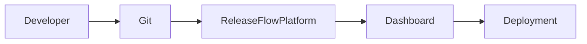

# 🚀 Release Flow Platform

> Theo dõi mọi thay đổi mã nguồn từ Môi trường Phát triển đến Production.

---

## 📖 Tài liệu hướng dẫn

| Tài liệu | Mô tả |
|----------|-------------|
| docs/01-overview.md | Tổng quan dự án |
| docs/02-business-flow.md | Quy trình nghiệp vụ |
| docs/03-domain-model.md | Thiết kế Domain |
| docs/04-architecture.md | Kiến trúc hệ thống |
| docs/05-database.md | Cơ sở dữ liệu & ERD |
| docs/06-api.md | REST API |
| docs/07-deployment.md | Triển khai |
| docs/08-roadmap.md | Lộ trình phát triển |
| docs/09-architectural-review.md | Đánh giá kiến trúc |

---

## Kiến trúc

---

## Tech Stack

Frontend

- Angular 20
- Angular Material
- TailwindCSS
- NgRx Signal Store

Backend

- NestJS
- Prisma
- PostgreSQL
- Redis
- BullMQ

Infrastructure

- Docker
- Docker Compose
- GitHub Actions