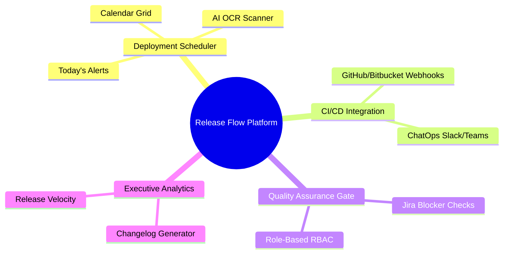

# Project Overview

## Problem Statement

Many enterprise teams still manage software deployment schedules using manual spreadsheets (Excel).

Key challenges of spreadsheet-based management:
*   **Missed Deployments**: Lack of central reminders leads to missed deployment windows.
*   **Zero Visibility**: Dev, QA, and Ops teams cannot easily track the progress or status of a specific release.
*   **Untrackable Releases**: Hard to mapping built packages (SHAs/versions) to exact environments and dates.
*   **Manual Planning**: Repetitive manual input is error-prone and doesn't scale with high deployment velocity.

---

## Vision

Build a powerful, automated **Internal Release Intelligence Platform (Release Flow Platform)** that bridges the gap between source code repositories, quality assurance gates, and multi-environment deployment calendars.

---

## Concept Mindmap

