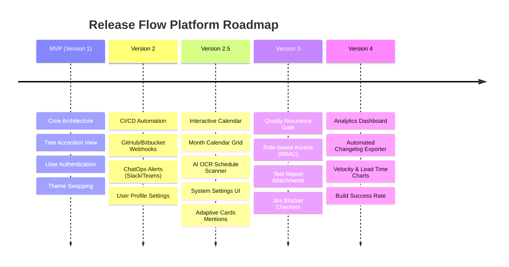

# Product Roadmap

This document outlines the development lifecycle of the **Release Flow Platform** from its inception (**MVP v1**) to current milestones (**v2.5**), and upcoming goals (**v3, v4**).

---

## 🗺️ Roadmap Timeline

---

## 🔹 MVP v1: Core Architecture & UI/UX (Completed)
*Focus: Establish a stable data mapping, design a highly responsive spreadsheet-like interface, and secure user data.*

*   **Tree-Indented Hierarchy**: Visualized multi-level releases (`ReleaseGroup` -> `Sub-release` -> `DeploymentItem`) with elegant connector lines.
*   **Excel-like Flat Data Grid**: Fast data rendering using Angular Material tables with server-side pagination, sorting, and cross-field filters.
*   **Contextual Record Creation**: Quick-create button (`+` icon) that inherits parent context and pre-fills target release values automatically.
*   **User Authentication**: JWT/Session based registration and login with bcrypt password hashing.

---

## 🔹 Version 2: CI/CD Webhooks & ChatOps (Completed)
*Focus: Eliminate manual data entry by connecting directly with source control managers and team messengers.*

*   **Repository Webhooks**: Automated endpoints (`POST /api/webhooks/github` and `/bitbucket`) that parse pull request payloads to extract ticket IDs (`MAG-\d+`), source branches, and commit authors.
*   **Target Release Matching**: Algorithmic mapping of branches to releases based on naming conventions (e.g., target `release/1.12` maps to `sow/1.12.x`).
*   **ChatOps alerts**: Realtime webhook notifications sent to **Slack** and **Microsoft Teams** on deployment creation/state changes.
*   **Profile Settings**: Let users update usernames, emails, passwords, avatars, and configure Personal Notification Preferences (Telegram, Slack, Teams, Email) directly from the frontend client.

---

## 🔹 Version 2.5: Interactive Calendar & AI OCR Scanner (Completed)
*Focus: Simplify scheduling operations and automate bulk calendar planning via machine learning simulation.*

*   **Month Calendar Grid**: CSS Grid calendar replacing flat lists. Days display indicator dots corresponding to active environments (Devel, UAT, STG, Production).
*   **AI OCR Schedule Scanner**: Drag-and-drop zone that scans spreadsheets/email screenshots, runs a mock OCR extraction workflow, and maps schedules (Build Environment, Build Time, and target Fix Version).
*   **Automatic Cleanup on Sync**: Deletes pre-existing schedules for the target month before syncing new OCR inputs to prevent duplicate entries and outdated times.
*   **10:00 AM Default Time**: Automatically formats build times to 10:00 AM across form creators and OCR simulations.
*   **Simplified Inputs**: Shifted UI focus from complex policies to simple fields: Build Environment, Build Time, and Fix Version.
*   **Adaptive Cards & UI Settings**: Upgraded MS Teams notifications to use Adaptive Cards with direct user @mentions based on UPN mapping. Added a System Settings UI for managing webhooks without touching `.env`.

---

## 🔹 Version 3: Quality Assurance Gate (Planned)
*Focus: Enforce strict quality assurance policies before deploying code packages to higher environments.*

*   **Role-Based Access Control (RBAC)**:
    *   *Developers*: Create items, edit branch/build URLs, mark features as merged.
    *   *QA/QCs*: Approve/Reject ticket readiness, input QC Status, upload test automation reports.
    *   *Release Managers*: Full authorization to execute windows and deploy releases to Production.
*   **Jira Blocker Validation**: Automatically query Jira/GitHub issues. Prevent execution of a deployment window if any linked tickets have open blocker/critical bugs.

---

## 🔹 Version 4: Analytics Dashboard (Planned)
*Focus: Provide executive visibility into development efficiency and build stability.*

*   **Automated Changelog Exporter**: 1-click exporter that parses all merged tickets in a release package, groups them into *Features*, *Fixes*, and *Improvements*, and downloads them as a Markdown/PDF document.
*   **Release Metrics (Executive Dashboard)**:
    *   *Release Velocity*: Trailing releases deployed per week/month.
    *   *Build Success Rate*: Success/Failure ratio on STG/Production environments.
    *   *Lead Time for Changes*: Average duration from commit merge to QA approval.