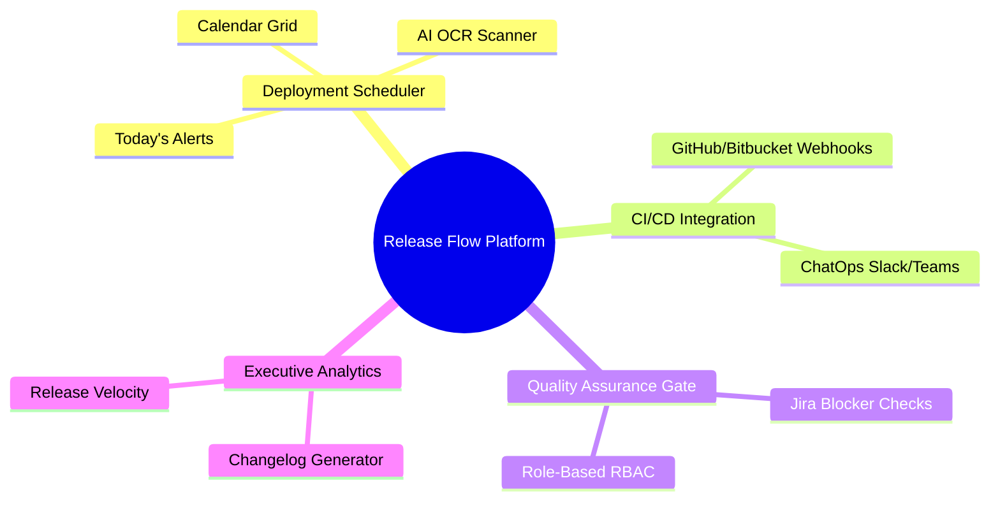

# Project Overview

## Problem Statement

Many enterprise teams still manage software deployment schedules using manual spreadsheets (Excel).

Key challenges of spreadsheet-based management:
*   **Missed Deployments**: Lack of central reminders leads to missed deployment windows.
*   **Zero Visibility**: Dev, QA, and Ops teams cannot easily track the progress or status of a specific release.
*   **Untrackable Releases**: Hard to mapping built packages (SHAs/versions) to exact environments and dates.
*   **Manual Planning**: Repetitive manual input is error-prone and doesn't scale with high deployment velocity.

---

## Vision

Build a powerful, automated **Internal Release Intelligence Platform (Release Flow Platform)** that bridges the gap between source code repositories, quality assurance gates, and multi-environment deployment calendars.

---

## Roadmap Goals

### MVP (Version 1) - Core Platform & UI/UX (Completed)
*   **User Authentication & Security**: Register, login using bcrypt hashing, route guards, and secure password resetting.
*   **Source Code Changes Tracking**: Automatically track repository merges (source branch to target branch).
*   **Release Version Mapping**: Group deployment items under specific release versions (`ReleaseStream`).
*   **Build Environment Tracking**: Track destination environments (`dev`, `devel`, `STG`, `UAT`, `Production`).
*   **Personalization**: Synchronize dark/light theme options to the user's DB configuration.

### Version 2 - CI/CD Webhooks & ChatOps (Completed)
*   **CI/CD Webhook Integration**: Auto-extract ticket IDs, source branches, and developers from GitHub/Bitbucket pull requests.
*   **Automated Target Version Matching**: Map target versions dynamically based on branch prefixes (e.g., `release/1.12` -> `sow/1.12.x`).
*   **ChatOps Alerts**: Broadcast realtime deployment updates to Slack and Microsoft Teams channels.

### Version 2.5 - Interactive Calendar & AI OCR Scanner (Completed)
*   **Interactive Month Calendar Grid**: Drag/click interactive layout representing environmental deployments.
*   **AI OCR Schedule Scanner**: Automatically parse and map deployment schedules directly from uploaded image spreadsheets or emails.
*   **Today's Alerts**: A campaign-style alert banner displaying upcoming deployment events starting today.
*   **Simplified Form Layout**: Clean interface focused only on Build Environment, Build Time (default to 10:00 AM), and target Fix Version.

### Version 3 - Quality Assurance Gate (QA/QC Verification Hub) (Planned)
*   **Role-Based Access Control (RBAC)**: Distinct permissions for Developers, QA/QCs, and Release Managers.
*   **Jira Blocker Validation**: Automatically block production release window execution if linked Jira tickets have open critical/blocker bugs.

### Version 4 - Analytics & Automation (Planned)
*   **Automated Changelog Generator**: 1-click Markdown/PDF exporter grouped by Features, Fixes, and Improvements.
*   **Release Analytics Dashboard**: Charts showing Lead Time for Changes, Release Velocity, and Build Success Rate.

---

## Concept Mindmap

