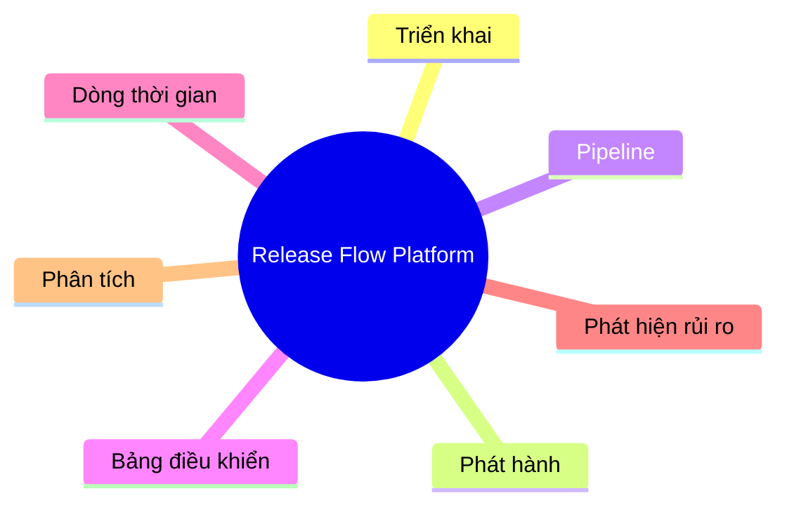

# Tổng quan dự án

## Vấn đề

Nhiều công ty vẫn đang quản lý việc triển khai (deployment) bằng Excel.

Các vấn đề gặp phải:

- Bỏ lỡ lịch triển khai (Miss deployment)
- Thiếu sự minh bạch/khả năng quan sát quá trình triển khai (No deployment visibility)
- Khó khăn trong việc theo dõi phiên bản phát hành (Hard to track release)
- Lên kế hoạch thủ công (Manual planning)

---

## Tầm nhìn

Xây dựng một Nền tảng Trí tuệ Phát hành Nội bộ (Internal Release Intelligence Platform).

---

## Mục tiêu

### Trọng tâm MVP (Version 1)
* **Xác thực & Bảo mật người dùng**: Đăng ký, đăng nhập bảo mật bằng bcrypt hashing, quản lý phiên làm việc cục bộ, phân quyền truy cập tuyến đường bằng Guard, và cơ chế **Quên & Thiết lập lại Mật khẩu** bảo mật qua secure token có thời hạn 1 giờ.
* **Theo dõi vết thay đổi nguồn**: Ghi nhận tự động ai đã thực hiện merge, từ nhánh nào sang nhánh nào (`dev` hoặc `devel`).
* **Định vị phiên bản phát hành**: Liên kết mỗi sự kiện merge với một số phiên bản phát hành cụ thể (`ReleaseStream`).
* **Theo dõi đích bản build**: Ghi nhận trạng thái và môi trường build đích tương ứng.
* **Cấu hình giao diện cá nhân**: Cho phép người dùng chuyển đổi giao diện Sáng/Tối và đồng bộ cấu hình này lên cơ sở dữ liệu.

### Tầm nhìn dài hạn (Version 2+)
* **Tự động hóa qua Webhook (Version 2)**: Tích hợp trực tiếp với GitHub/GitLab Webhooks để tự động hóa khâu tạo bản ghi deployment từ PR/Merge events và phát thông báo qua Slack/Teams.
* **Cổng xác thực chất lượng & Phân quyền (Version 3)**: Xây dựng cổng kiểm thử QA/QC, phân quyền người dùng (Dev, QA, Release Manager) và kết nối Jira API để tự động chặn phát hành nếu phát hiện lỗi blocker.
* **Báo cáo & Phân tích thông minh (Version 4)**: Tự động xuất tài liệu Release Notes / Changelog (PDF/Markdown) theo Change Type và đo lường tần suất phát hành qua biểu đồ trực quan.

---

## Khái quát chung

