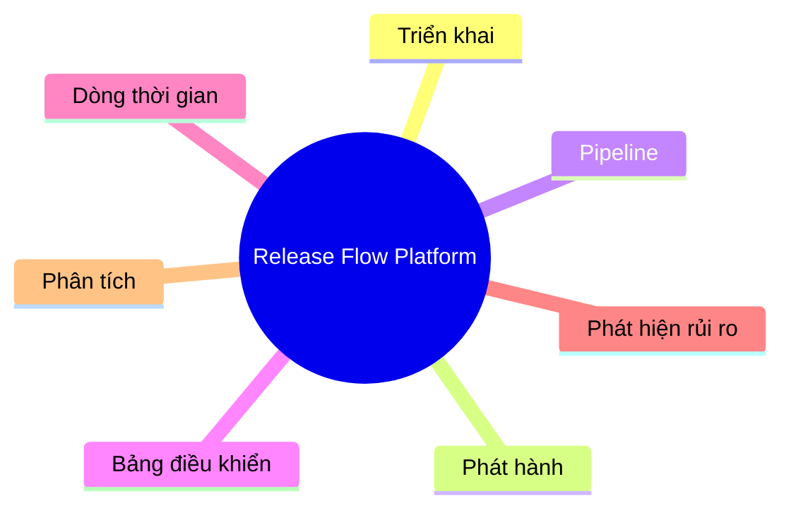

# Tổng quan dự án

## Vấn đề

Nhiều công ty vẫn đang quản lý việc triển khai (deployment) bằng Excel.

Các vấn đề gặp phải:

- Bỏ lỡ lịch triển khai (Miss deployment)
- Thiếu sự minh bạch/khả năng quan sát quá trình triển khai (No deployment visibility)
- Khó khăn trong việc theo dõi phiên bản phát hành (Hard to track release)
- Lên kế hoạch thủ công (Manual planning)

---

## Tầm nhìn

Xây dựng một Nền tảng Trí tuệ Phát hành Nội bộ (Internal Release Intelligence Platform).

---

## Mục tiêu

### Trọng tâm MVP (Version 1)
* **Xác thực & Bảo mật người dùng**: Đăng ký, đăng nhập bảo mật bằng bcrypt hashing, quản lý phiên làm việc cục bộ và phân quyền truy cập tuyến đường bằng Guard.
* **Theo dõi vết thay đổi nguồn**: Ghi nhận tự động ai đã thực hiện merge, từ nhánh nào sang nhánh nào (`dev` hoặc `devel`).
* **Định vị phiên bản phát hành**: Liên kết mỗi sự kiện merge với một số phiên bản phát hành cụ thể (`ReleaseStream`).
* **Theo dõi đích bản build**: Ghi nhận trạng thái và môi trường build đích tương ứng.
* **Cấu hình giao diện cá nhân**: Cho phép người dùng chuyển đổi giao diện Sáng/Tối và đồng bộ cấu hình này lên cơ sở dữ liệu.

### Tầm nhìn dài hạn (Version 2+)
* **Trực quan hóa quy trình triển khai**: Quản lý pipeline qua các môi trường STG, UAT và Production.
* **Giảm thiểu rủi ro triển khai**: Kiểm soát khung giờ triển khai (Deployment Windows) và các cổng chất lượng.
* **Cải thiện việc lên kế hoạch phát hành**: Sử dụng phân tích dữ liệu và AI để tối ưu hóa việc phân chia và sắp xếp lịch phát hành.

---

## Khái quát chung

