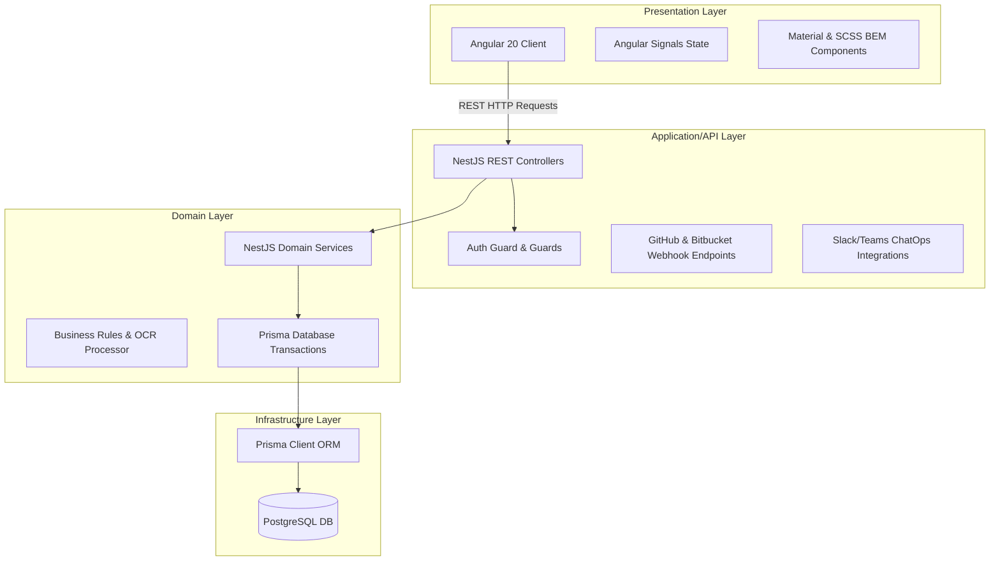

# System Architecture

The **Release Flow Platform** is built using a clean, layered architecture designed to enforce separation of concerns, scalability, and ease of automated integrations.

---

## Architecture Layers

### 1. Presentation Layer (Angular Frontend)
*   **Modern Framework**: Built on Angular, leveraging standalone components for high reusability and isolated testing.
*   **Reactive State**: Utilizes **Angular Signals** (`signal`, `computed`) for efficient, lag-free state propagation without memory leaks.
*   **Modular Styling**: Styled using vanilla CSS and SCSS BEM structure (`block__element--modifier`), styled with customized design tokens to support smooth Light/Dark theme switching.
*   **Key Modules**:
    *   **Dashboard**: Excel-like flat data table with pagination, filtering, sorting, and contextual creation.
    *   **Scheduler**: Interactive month grid, AI OCR Uploader laser simulator, and daily schedule detailed view sidebar.

### 2. Application & API Layer (NestJS Controllers)
*   **Modular Framework**: Built using NestJS modules (e.g., `UsersModule`, `DeploymentItemsModule`, `DeploymentWindowsModule`).
*   **Validation**: Uses NestJS `ValidationPipe` with `class-validator` to enforce correct payload structures on all requests.
*   **Authentication**: Custom Auth Guards verify JWT/session tokens.
*   **External Integration (Webhooks)**: Dedicated REST endpoints parse external payloads from GitHub and Bitbucket, mapping source branches to target releases.

### 3. Domain Layer (Business Logic Services)
*   **Pure Domain Services**: Houses core business rules (e.g., finding the correct environment mapping, calculating freeze time).
*   **AI OCR Matching**: Maps parsed schedule dates and environments to actual DB IDs, automatically defaulting build start times to 10:00 AM.
*   **Atomic Transactions**: Wraps cascade operations inside secure Prisma database transactions (`prisma.$transaction`).

### 4. Infrastructure & Data Layer (PostgreSQL & Prisma)
*   **Object-Relational Mapping**: Prisma Client provides full type safety for database models and schema synchronization.
*   **Normalized SQL DB**: PostgreSQL stores relational data:
    *   `users`: User credentials, avatar base64 data, and configurations.
    *   `deployment_items`: Track branch merges and build links.
    *   `deployment_windows`: Schedule windows.
*   **Cloud Migrations**: Database schema migrations run automatically via `prisma migrate deploy` in the cloud environment build phase.