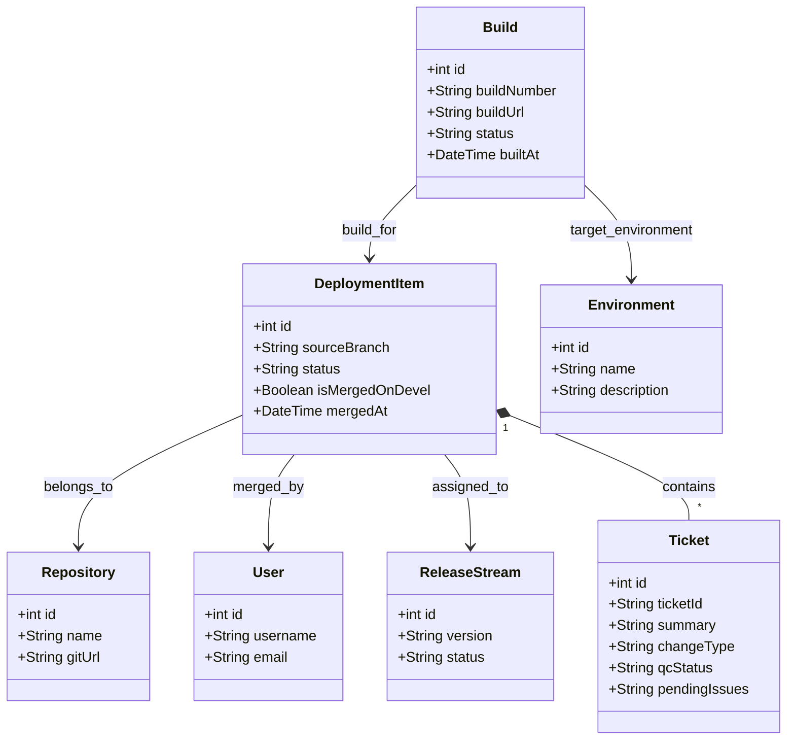

# Domain Model Design (MVP V1 & Extensibility)

To ensure long-term scalability from MVP V1 to automated future versions without requiring database refactoring, the Domain Model is designed using **normalization** strategies. The user interface will still aggregate this data to display a flat, Excel-like table.

---

## Entity Details & Extensibility Strategy

### 1. Repository
* **Purpose**: Represents source code projects (e.g., `Core`, `E-com`).
* **Extensibility (V2+)**: Can attach Webhook secrets, Access Tokens, Git Providers (GitHub/GitLab), or default branch configurations per Repo.

### 2. Ticket
* **Purpose**: Stores task ticket information (e.g., `MAG-20479`, `MAG-20550`).
* **Why isolate from Deployment Item?** 
  * In reality, a single merge event might contain multiple bundled tickets (like row 17 in the original Excel: `MAG-20550, MAG-20538...`). A 1-to-many relationship elegantly solves this.
  * **Extensibility (V3+)**: Easily enables automatic two-way sync with Jira/Trello APIs without impacting the Git merge flow.

### 3. Build & Environment
* **Purpose**: 
  * `Environment` defines target environments (`dev`, `devel`, and later `STG`, `UAT`, `PROD`).
  * `Build` records actual CI/CD build history for specific Tickets.
* **Why not use a Flat String?**
  * Storing as a flat string (e.g., `"cxpro-dev2-build, devel"`) blocks future V2 automation.
  * Isolating into entities allows us to store metadata like: Jenkins/GitHub Actions build links, Build status (`SUCCESS`/`FAILED`), and execution time. On the UI side, we simply aggregate these strings for clean display.

### 4. Deployment Item
* **Purpose**: The core data row. Records a merge event from a feature branch (`sourceBranch`) to a target branch, links the executing `User`, and assigns it to a `ReleaseStream`.

### 5. Release Stream
* **Purpose**: Defines the release version (e.g., `som/1.12.x`). 
* **Extensibility (V2+)**: Support for deployment scheduling and release states (Draft, Active, Archived).