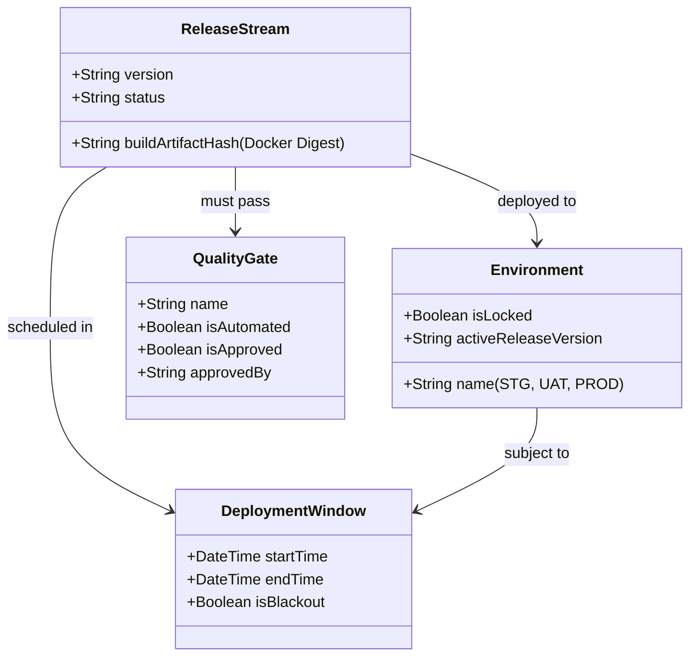

# Future Architecture Proposals

> [!IMPORTANT]
> **Future Planning Document**: This document does not reflect the current MVP (V1 & V2.5) architecture. It is an in-depth analysis of the current system's limitations and proposes advanced enterprise solutions (like Quality Gates, Rollbacks, Environment Leasing, and Decision Engines) intended for **Phase 2 (V3, V4, and beyond)**.

---

## 1. Current Workflow Summary

The proposed deployment cycle follows a sequential pipeline for normal releases, and a direct-to-production path for hotfixes:

```mermaid
flowchart TD
    %% Normal Release Flow
    subgraph Normal Release Flow
        Dev[Developer] --> FB[Feature Branch]
        FB --> MR[Merge Request]
        MR --> Devel[Merge to Devel]
        Devel --> RV[Assign Release Version]
        RV --> STG[Deploy STG]
        STG --> UAT[Deploy UAT]
        UAT --> Prod[Deploy Production]
    end

    %% Hotfix Flow
    subgraph Hotfix Flow
        ProdSource[Production Codebase] --> HB[Hotfix Branch]
        HB --> RH[Release Hotfix]
        RH --> ProdDeploy[Deploy Production]
    end
    
    style Normal Release Flow fill:#f5f7fa,stroke:#d3d3d3,stroke-width:1px
    style Hotfix Flow fill:#fff5f5,stroke:#feb2b2,stroke-width:1px
```

---

## 2. Missing Business Scenarios

Evaluating the current workflow reveals several critical enterprise scenarios that need addressing in future phases:

### 2.1. Release Gating & Quality Gates
* **Problem**: The current flow transitions directly from `Deploy STG` → `Deploy UAT` → `Deploy Production` without explicit approval mechanisms.
* **Missing Scenario**: Who approves environment transitions? We need:
  * **Manual Approvals**: QA Managers approve UAT promotion; Product Owners approve Production deployment.
  * **Automated Gates**: Requirements like >98% integration test pass rates, clean security scans (SonarQube/Snyk), and performance budget checks.

### 2.2. Hotfix Verification & Sandbox Isolation
* **Problem**: The hotfix workflow currently allows direct deployment from `Release Hotfix` to `Deploy Production`.
* **Missing Scenario**: Pushing untested code directly to Production risks severe regressions. A dedicated **Hotfix Sandbox** (or STG-Hotfix) environment is required for smoke testing before Production.

### 2.3. Release Bundling vs. Single-Feature Deploys
* **Problem**: When multiple developers merge code into `devel`, they are bundled into a single release version (e.g., `1.12`).
* **Missing Scenario**: 
  * If Feature A and Feature B are both in UAT (in package `1.12`), but QA rejects Feature A, how do we **decouple** Feature A from the release stream without rewriting Git history or reverting and rebuilding everything?

### 2.4. Deployment Freeze / Blackout Calendars
* **Problem**: Deployment windows are configurable, but lack strict overriding restrictions.
* **Missing Scenario**: Enterprises require **deployment freezes** during critical periods (e.g., major shopping holidays, end of financial quarters). The platform must support "Blackout Periods" that block all Production deployments regardless of normal window schedules.

### 2.5. Environment Lease & Lease Booking
* **Problem**: UAT and STG are finite, shared environments.
* **Missing Scenario**: If Developer X deploys version `1.12` to UAT, how do we prevent Developer Y from deploying `1.13` and overwriting X's testing environment? The platform needs an **Environment Lease** concept to lock environments currently in use.

### 2.6. Rollback & Recovery Workflow
* **Problem**: The current process lacks a defined rollback flow for deployment failures or post-deployment bug discoveries.
* **Missing Scenario**: Rollback options must be platform-native:
  * **Infrastructure Rollback (Fast Container Rollback)**: Rapidly redeploy the previous stable Docker Image (< 2 mins).
  * **GitOps Revert**: Automatically create and execute a Merge Request to cleanly revert code on the Git branch.

---

## 3. Edge Cases to Resolve

These technical and operational anomalies must be addressed in Phase 2:

### 3.1. Hotfix Regression Loop / Backporting
* **Scenario**: Hotfix `1.12.1` is deployed directly to Production.
* **Exception**: If this hotfix branch is not merged back (backported) into the `devel` branch, the next normal release (e.g., `1.13`) will overwrite and erase this fix, causing the bug to resurface.
* **Requirement**: The system must automatically verify backporting to `devel` and block subsequent deployments until resolved.

### 3.2. Missed Window Queue Stacking
* **Scenario**: A release misses its window and is pushed to the "Next Window" by the Decision Engine.
* **Exception**: If multiple sequential releases (e.g., `1.12` and `1.13`) miss their windows, they bottleneck in the queue.
* **Requirement**: Should they deploy sequentially (consuming multiple windows)? Or coalesce into one massive release (changing the testing scope)? The Decision Engine requires policy-based rules to handle queue stacking.

### 3.3. Build Artifact Drift
* **Scenario**: Source code is re-compiled at every environment stage (STG, UAT, Prod).
* **Exception**: Dependency versions might resolve differently (e.g., using `^4.17.21`) between the STG and UAT builds, causing UAT failures that didn't exist in STG.
* **Requirement**: Enforce **Immutable Artifacts**. Build a Docker image *once* (upon merge to `devel`), capture its SHA digest, and promote that exact immutable container image across STG, UAT, and Production.

---

## 4. Proposed Architecture Improvements (Phase 2+)

To evolve from a tracking tool into a true **Enterprise Release Intelligence Platform**, we propose the following upgrades:

### 4.1. Updated Domain Model
Expand the model to support Environment management, Quality Gates, and Immutable Artifacts:

### 4.2. Core Proposals

1. **Build Once, Promote Everywhere (Immutable Artifacts)**
   * Store the Docker registry digest/SHA in the `ReleaseStream` entity.
   * Ensure deployment scripts pull the exact validated hash, never rebuilding code during environment transitions.

2. **Mandatory Hotfix Backporting**
   * Rule: Creating a Hotfix automatically tracks a "Backport Merge Request" to `devel`.
   * Block the next normal Production deployment if the backport is unmerged (unless overridden by management).

3. **Gated Progression**
   * Define explicit **Promotion Gates** in Pipeline configurations.
   * A release only promotes to the next environment when all gate conditions (tests passed, manager sign-off) are met.

4. **Break-Glass Mode (Emergency Bypass)**
   * Design an emergency deployment mode for Production.
   * This mode bypasses normal windows and gates but triggers high-priority executive alerts and automatically opens a post-mortem document.

5. **Reconciliation Engine**
   * Utilize a background worker (BullMQ/Redis) to periodically poll the Git Repository (e.g., every 5-10 minutes) to correct data drift if webhooks fail.

6. **Database Migration Strategy (Expand & Contract)**
   * Enforce backward-compatible schema migrations.
   * Apply "Expand & Contract": Expand the schema (add new column alongside the old), run the app supporting both, migrate data via jobs, and only contract (delete the old column) when stable.
