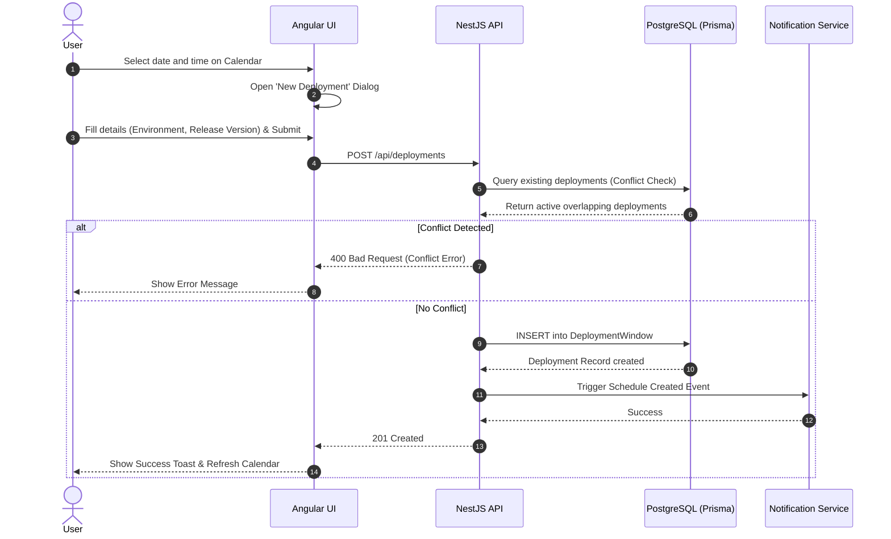

# Deployment Scheduler

## 1. Feature Overview
The Deployment Scheduler allows Release Managers and Developers to visually manage multi-environment deployment schedules on an interactive calendar grid. It provides drag-and-drop capabilities, bulk actions, and real-time conflict detection to ensure deployments are executed smoothly.

## 2. Use Case Diagram

```mermaid
usecase
  actor "Release Manager" as RM
  actor "Developer" as DEV
  actor "System" as SYS

  package "Deployment Scheduler" {
    usecase "View Calendar" as UC1
    usecase "Schedule Deployment" as UC2
    usecase "Update/Reschedule" as UC3
    usecase "Cancel Deployment" as UC4
    usecase "Detect Conflicts" as UC5
  }

  RM --> UC1
  RM --> UC2
  RM --> UC3
  RM --> UC4
  DEV --> UC1
  DEV --> UC2

  UC2 ..> UC5 : <<include>>
  UC3 ..> UC5 : <<include>>
  SYS --> UC5
```

## 3. Sequence Diagram (Schedule a Deployment)


