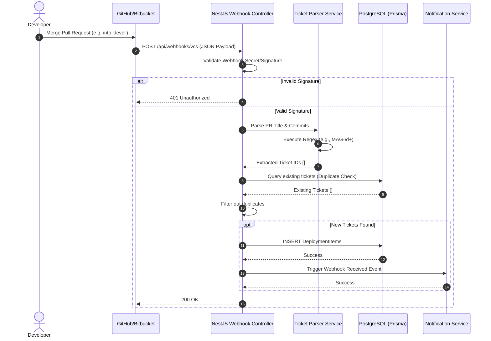

# CI/CD Webhook Automation

## 1. Feature Overview
The CI/CD Webhook Automation feature integrates the Release Flow Platform directly with version control systems (GitHub, Bitbucket). It listens for Pull Request (Merge Request) events and automatically extracts Jira Ticket IDs, branch names, and authors, mapping them to the correct release version and environment without manual data entry.

## 2. Use Case Diagram

```mermaid
usecase
  actor "Developer" as DEV
  actor "VCS (GitHub/Bitbucket)" as VCS
  actor "System" as SYS

  package "CI/CD Automation" {
    usecase "Merge Pull Request" as UC1
    usecase "Receive Webhook Event" as UC2
    usecase "Extract Ticket IDs (Regex)" as UC3
    usecase "Filter Duplicates" as UC4
    usecase "Save Deployment Item" as UC5
    usecase "Notify Team" as UC6
  }

  DEV --> UC1
  VCS --> UC2 : Triggers
  
  SYS --> UC3
  SYS --> UC4
  SYS --> UC5
  SYS --> UC6

  UC2 ..> UC3 : <<include>>
  UC3 ..> UC4 : <<include>>
  UC4 ..> UC5 : <<include>>
  UC5 ..> UC6 : <<include>>
```

## 3. Sequence Diagram (Handle PR Merge Webhook)


