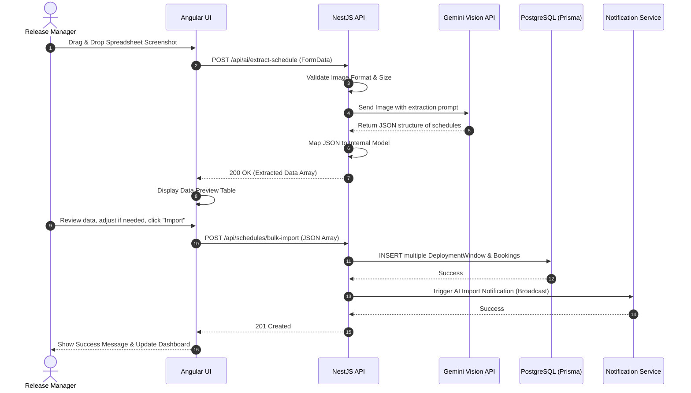

# AI OCR Scanner

## 1. Feature Overview
The AI OCR Scanner allows users to bypass manual entry entirely by uploading images (e.g., screenshots of Excel spreadsheets or emails). The system uses external AI Vision APIs to extract the deployment schedules and import them directly into the database.

## 2. Use Case Diagram

```mermaid
usecase
  actor "Release Manager" as RM
  actor "System" as SYS
  actor "Google Gemini/Vision API" as AI

  package "AI OCR Scanner" {
    usecase "Upload Image" as UC1
    usecase "Process Image via AI" as UC2
    usecase "Parse JSON Output" as UC3
    usecase "Preview Extracted Data" as UC4
    usecase "Confirm Import" as UC5
  }

  RM --> UC1
  RM --> UC4
  RM --> UC5

  SYS --> UC2
  SYS --> UC3

  UC1 ..> UC2 : <<include>>
  UC2 --> AI : Calls API
  UC3 ..> UC4 : <<include>>
```

## 3. Sequence Diagram (Extract and Import)


