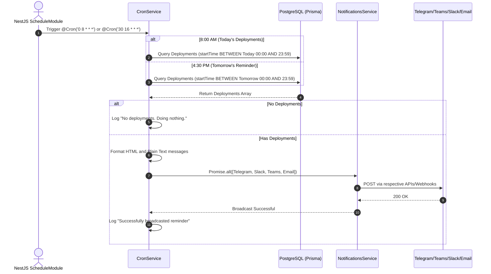

# Automated Cron Reminders

## 1. Feature Overview
To prevent missed deployment windows and ensure all developers merge their code on time, the system runs scheduled background tasks (Cron Jobs). These jobs automatically summarize upcoming deployments and broadcast reminders to the team via Telegram, Slack, MS Teams, and Email.

## 2. Use Case Diagram

```mermaid
usecase
  actor "System Scheduler (Cron)" as CRON
  actor "Database" as DB
  actor "Notification Service" as NS
  actor "Developer / Team" as TEAM

  package "Automated Reminders" {
    usecase "Trigger 8:00 AM Job (Today's Deployments)" as UC1
    usecase "Trigger 4:30 PM Job (Tomorrow's Reminder)" as UC2
    usecase "Query Deployment Windows" as UC3
    usecase "Format Message" as UC4
    usecase "Broadcast Alert" as UC5
  }

  CRON --> UC1
  CRON --> UC2

  UC1 ..> UC3 : <<include>>
  UC2 ..> UC3 : <<include>>
  
  UC3 --> DB
  UC3 ..> UC4 : <<include>>
  UC4 ..> UC5 : <<include>>
  
  UC5 --> NS
  NS --> TEAM
```

## 3. Sequence Diagram (8:00 AM & 4:30 PM Jobs)


