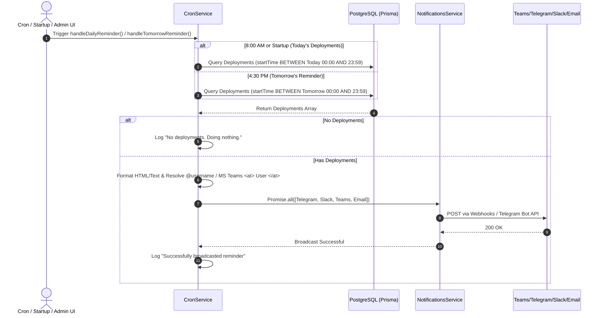

# Automated Cron Reminders & Job Management UI

## 1. Feature Overview
To prevent missed deployment windows and ensure all developers merge their code on time, the system runs scheduled background tasks (Cron Jobs) and an App Startup check (`OnModuleInit`). These jobs automatically summarize upcoming deployments, resolve `@username` mentions with MS Teams `<at>username</at>` ping cards, and broadcast reminders to the team via Telegram, Slack, MS Teams, and Email.

Administrators can monitor and trigger these automated background jobs on demand via the **Automated Cron Jobs Manager UI** inside **System Configuration**.

---

## 2. Key Features
- **App Startup Scan (`OnModuleInit`)**: Automatically checks database on server boot or morning restart and broadcasts today's deployment summary.
- **Daily 08:00 AM Morning Job**: Summarizes today's active deployment schedules and mentions responsible developers.
- **Daily 16:30 PM Afternoon Warning Job**: Scans tomorrow's deployment schedules and warns team to merge code on time.
- **Native User Mentions**: Formats `@username` for Telegram, Slack, Email, and constructs MS Teams AdaptiveCard `<at>username</at>` entities targeting `user.email` for instant push notifications.
- **Automated Cron Jobs Manager UI**: Accessible under **System Configuration > Automated Cron Jobs**, displaying job status badges (`ACTIVE`), schedule times, target channels, and an instant **`[Run Job Now]`** trigger button.

---

## 3. Use Case Diagram

```mermaid
usecase
  actor "System Scheduler (Cron/OnModuleInit)" as CRON
  actor "Administrator" as ADMIN
  actor "Database" as DB
  actor "Notification Service" as NS
  actor "Developer / Team" as TEAM

  package "Automated Reminders & Job Manager" {
    usecase "Trigger 8:00 AM Job (Today's Deployments)" as UC1
    usecase "Trigger 4:30 PM Job (Tomorrow's Reminder)" as UC2
    usecase "App Startup Auto Check (OnModuleInit)" as UC1a
    usecase "View & Trigger Jobs via UI" as UC1b
    usecase "Query Deployment Windows" as UC3
    usecase "Format Message with User @Mentions" as UC4
    usecase "Broadcast Alert (Teams/Telegram/Slack/Email)" as UC5
  }

  CRON --> UC1
  CRON --> UC2
  CRON --> UC1a
  ADMIN --> UC1b

  UC1 ..> UC3 : <<include>>
  UC2 ..> UC3 : <<include>>
  UC1a ..> UC3 : <<include>>
  UC1b ..> UC3 : <<include>>
  
  UC3 --> DB
  UC3 ..> UC4 : <<include>>
  UC4 ..> UC5 : <<include>>
  
  UC5 --> NS
  NS --> TEAM
```

---

## 4. Sequence Diagram (Automated Reminders & UI Trigger)

```mermaid
sequenceDiagram
    autonumber
    actor Trigger as Cron / Startup / Admin UI
    participant Service as CronService
    participant DB as PostgreSQL (Prisma)
    participant Notif as NotificationsService
    participant Channels as Teams/Telegram/Slack/Email

    Trigger->>Service: Trigger handleDailyReminder() / handleTomorrowReminder()
    
    alt 8:00 AM or Startup (Today's Deployments)
        Service->>DB: Query Deployments (startTime BETWEEN Today 00:00 AND 23:59)
    else 4:30 PM (Tomorrow's Reminder)
        Service->>DB: Query Deployments (startTime BETWEEN Tomorrow 00:00 AND 23:59)
    end
    
    DB-->>Service: Return Deployments Array
    
    alt No Deployments
        Service->>Service: Log "No deployments. Doing nothing."
    else Has Deployments
        Service->>Service: Format HTML/Text & Resolve @username / MS Teams <at> User </at>
        Service->>Notif: Promise.all([Telegram, Slack, Teams, Email])
        
        Notif->>Channels: POST via Webhooks / Telegram Bot API
        Channels-->>Notif: 200 OK
        Notif-->>Service: Broadcast Successful
        Service->>Service: Log "Successfully broadcasted reminder"
    end
```
