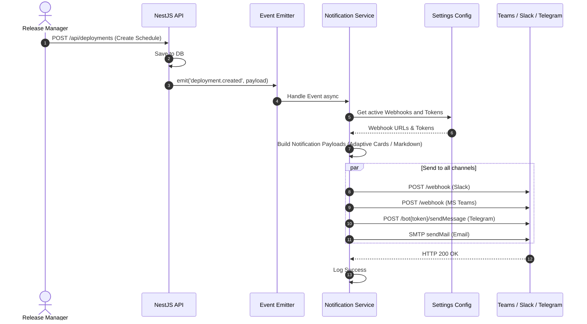

# ChatOps & Notifications

## 1. Feature Overview
The ChatOps feature bridges the Release Flow Platform with team communication tools (Telegram, Email, MS Teams, Slack). It broadcasts real-time alerts whenever a significant event occurs, such as a deployment schedule being created, updated, or an AI OCR import completing. It supports both Global/System-wide broadcasts and Personal Direct Messages (DMs).

## 2. Use Case Diagram

```mermaid
usecase
  actor "User / System Event" as EVENT
  actor "Notification Service" as NS
  actor "Team Channel (Global)" as GLOB
  actor "Developer (Personal)" as PERS

  package "ChatOps & Notifications" {
    usecase "Trigger Notification Event" as UC1
    usecase "Format Message (Markdown/HTML)" as UC2
    usecase "Resolve Mention Tags (@UPN)" as UC3
    usecase "Send Global Broadcast" as UC4
    usecase "Send Personal Direct Message" as UC5
  }

  EVENT --> UC1
  UC1 ..> UC2 : <<include>>
  UC2 ..> UC3 : <<include>>
  
  UC3 --> NS
  
  NS --> UC4
  NS --> UC5

  UC4 --> GLOB
  UC5 --> PERS
```

## 3. Sequence Diagram (Event-Driven Notification)


