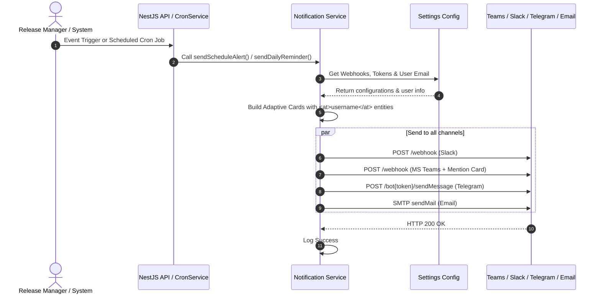

# ChatOps & Notifications

## 1. Feature Overview
The ChatOps feature bridges the Release Flow Platform with team communication tools (Telegram, Email, MS Teams, Slack). It broadcasts real-time alerts whenever a significant event occurs, such as a deployment schedule being created, updated, or an AI OCR import completing. It supports both Global/System-wide broadcasts, Automated Daily Reminders, and User Mentions (`@username` / MS Teams `<at>username</at>`).

---

## 2. Key Features
- **Multi-Channel Delivery**: Instant broadcast across Telegram, Slack, MS Teams, and Email.
- **Native User Mentions**: Resolves developer usernames to format HTML/Text `@username` for Telegram/Slack and constructs AdaptiveCard `msteams.entities` `<at>username</at>` targeting `user.email` for MS Teams push notifications.
- **Event-Driven & Scheduled Alerts**: Supports real-time triggers (schedule create/update) and scheduled cron reminders (08:00 AM today's deployments & 16:30 PM tomorrow's warnings).

---

## 3. Use Case Diagram

```mermaid
usecase
  actor "User / System Event / Cron" as EVENT
  actor "Notification Service" as NS
  actor "Team Channel (Global)" as GLOB
  actor "Developer (Personal Mention)" as PERS

  package "ChatOps & Notifications" {
    usecase "Trigger Notification Event" as UC1
    usecase "Format Message (Markdown/HTML)" as UC2
    usecase "Handle Empty Links & Fallbacks" as UC2a
    usecase "Resolve Mention Tags (@username / MS Teams <at>)" as UC3
    usecase "Send Global Broadcast" as UC4
    usecase "Send Targeted Mention Alert" as UC5
  }

  EVENT --> UC1
  UC1 ..> UC2 : <<include>>
  UC2 ..> UC2a : <<include>>
  UC2 ..> UC3 : <<include>>
  
  UC3 --> NS
  
  NS --> UC4
  NS --> UC5

  UC4 --> GLOB
  UC5 --> PERS
```

---

## 4. Sequence Diagram (Event-Driven & Scheduled Notification)

```mermaid
sequenceDiagram
    autonumber
    actor User as Release Manager / System
    participant API as NestJS API / CronService
    participant NotifSvc as Notification Service
    participant Config as Settings Config
    participant External as Teams / Slack / Telegram / Email

    User->>API: Event Trigger or Scheduled Cron Job
    API->>NotifSvc: Call sendScheduleAlert() / sendDailyReminder()
    NotifSvc->>Config: Get Webhooks, Tokens & User Email
    Config-->>NotifSvc: Return configurations & user info
    
    NotifSvc->>NotifSvc: Build Adaptive Cards with <at>username</at> entities
    
    par Send to all channels
        NotifSvc->>External: POST /webhook (Slack)
        NotifSvc->>External: POST /webhook (MS Teams + Mention Card)
        NotifSvc->>External: POST /bot{token}/sendMessage (Telegram)
        NotifSvc->>External: SMTP sendMail (Email)
    end
    
    External-->>NotifSvc: HTTP 200 OK
    NotifSvc->>NotifSvc: Log Success
```
