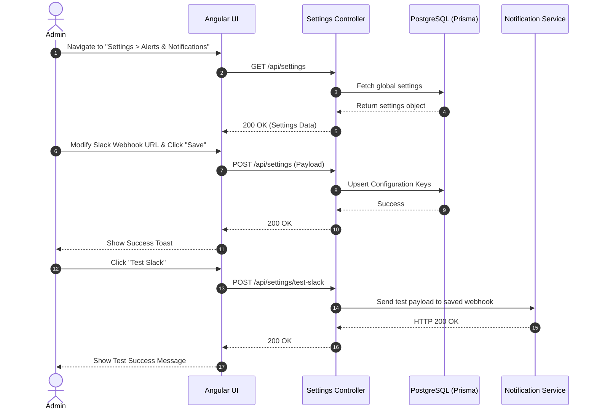

# System Settings UI

## 1. Feature Overview
The System Settings feature provides an administrative interface to configure global application variables, such as Webhook URLs (Slack, Teams), API Tokens (Telegram), and SMTP credentials. This allows the system to be dynamically configured at runtime without requiring `.env` file changes or application restarts.

## 2. Use Case Diagram

```mermaid
usecase
  actor "Administrator" as ADMIN
  actor "System" as SYS
  actor "Database" as DB

  package "System Settings" {
    usecase "View Configuration" as UC1
    usecase "Update API Tokens" as UC2
    usecase "Update Webhooks" as UC3
    usecase "Test Connection" as UC4
    usecase "Persist Settings" as UC5
  }

  ADMIN --> UC1
  ADMIN --> UC2
  ADMIN --> UC3
  ADMIN --> UC4
  
  UC2 ..> UC5 : <<include>>
  UC3 ..> UC5 : <<include>>
  
  SYS --> UC5
  UC5 --> DB
```

## 3. Sequence Diagram (Update & Test Settings)


