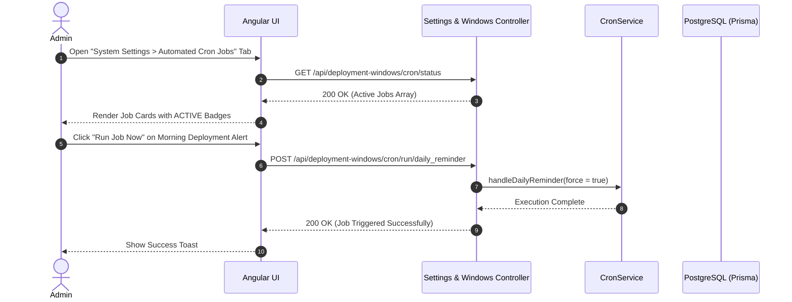

# System Settings & Automated Cron Jobs Manager UI

## 1. Feature Overview
The System Settings feature provides an administrative interface to configure global application variables (Slack/Teams Webhooks, Telegram Token/Chat ID, SMTP Credentials) and monitor/manage automated background jobs via the **Automated Cron Jobs Manager** tab.

---

## 2. Key Features
- **Dynamic Integration Settings**: Configures Telegram, MS Teams, Slack, and Email credentials dynamically at runtime.
- **Multi-Channel Connection Testing**: Includes instant "Test Message" triggers for each configured notification service.
- **Automated Cron Jobs Tab**: Displays real-time job cards (`Daily Morning Alert`, `Tomorrow Warning Alert`), schedule times, target channels, `ACTIVE` status badges, and an instant **`[Run Job Now]`** trigger button.

---

## 3. Use Case Diagram

```mermaid
usecase
  actor "Administrator" as ADMIN
  actor "System" as SYS
  actor "Database" as DB

  package "System Settings & Job UI" {
    usecase "View Integration Configs" as UC1
    usecase "Update API Tokens & Webhooks" as UC2
    usecase "Test Channel Connections" as UC4
    usecase "View Automated Cron Jobs Status" as UC6
    usecase "Trigger Cron Job On-Demand" as UC7
    usecase "Persist Settings" as UC5
  }

  ADMIN --> UC1
  ADMIN --> UC2
  ADMIN --> UC4
  ADMIN --> UC6
  ADMIN --> UC7
  
  UC2 ..> UC5 : <<include>>
  SYS --> UC5
  UC5 --> DB
```

---

## 4. Sequence Diagram (Update Settings & Trigger Cron Job)

```mermaid
sequenceDiagram
    autonumber
    actor Admin
    participant Frontend as Angular UI
    participant SettingsAPI as Settings & Windows Controller
    participant CronSvc as CronService
    participant DB as PostgreSQL (Prisma)

    Admin->>Frontend: Open "System Settings > Automated Cron Jobs" Tab
    Frontend->>SettingsAPI: GET /api/deployment-windows/cron/status
    SettingsAPI-->>Frontend: 200 OK (Active Jobs Array)
    Frontend-->>Admin: Render Job Cards with ACTIVE Badges
    
    Admin->>Frontend: Click "Run Job Now" on Morning Deployment Alert
    Frontend->>SettingsAPI: POST /api/deployment-windows/cron/run/daily_reminder
    SettingsAPI->>CronSvc: handleDailyReminder(force = true)
    CronSvc-->>SettingsAPI: Execution Complete
    SettingsAPI-->>Frontend: 200 OK (Job Triggered Successfully)
    Frontend-->>Admin: Show Success Toast
```
