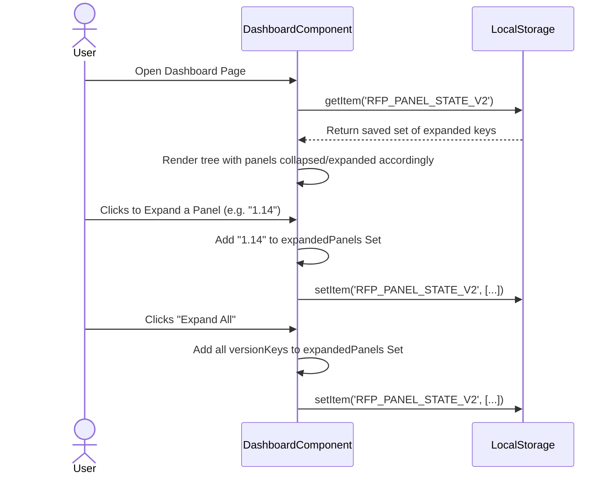

# 03.7 Dashboard Management

## 1. Overview
The Dashboard is the central Intelligence Hub of the Release Flow Platform. It provides a visual, Excel-like interface to track, filter, and group deployment records.

## 2. Core UI Features

### 2.1 Tree-indented Grouping
Records can be viewed in two modes:
- **Flat View:** A traditional Excel-like grid view showing all records matching the current filters.
- **Grouped View (Hierarchical):** Organizes deployment records into an interactive tree grouped by `ReleaseGroup` -> `Sub-release` -> `Patch`.

### 2.2 Expansion Panel State Persistence
To enhance user experience when managing large release streams:
- **Default State:** All hierarchical expansion panels default to a **collapsed** state on first load to prevent screen clutter.
- **State Memory:** The Dashboard remembers exactly which panels the user has expanded or collapsed via browser `localStorage` (`RFP_PANEL_STATE_V2`). Upon page refresh, the exact state of the tree is restored.
- **Bulk Toggle:** An "Expand All" / "Collapse All" button allows users to instantly open or close all branches simultaneously.

### 2.3 Floating Action Controls
- **Scroll to Top:** A floating action button (FAB) appears dynamically when the user scrolls down past 300px, providing quick navigation back to the top of the dashboard and toolbar.

## 3. Usecase Diagram

```mermaid
usecaseDiagram
    actor Developer
    actor DevOps
    
    package "Dashboard Management" {
        usecase "View Deployment Records" as UC1
        usecase "Toggle Grouping (Flat/Tree)" as UC2
        usecase "Expand/Collapse Panels" as UC3
        usecase "Persist View State" as UC4
        usecase "Scroll to Top" as UC5
    }
    
    Developer --> UC1
    DevOps --> UC1
    
    UC1 --> UC2 : extends
    UC2 --> UC3 : includes
    UC3 --> UC4 : triggers
    UC1 --> UC5 : extends
```

## 4. Sequence Diagram: Panel State Persistence


