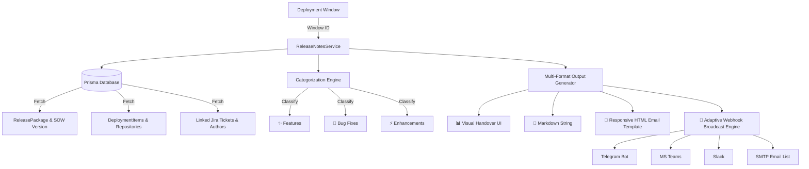

# 📄 03.8 Auto Release Notes & Deployment Handover Studio

> **Module Overview:** The Auto Release Notes & Handover Studio provides a 1-click automated solution for generating executive release notes, technical scope reports, and QA sign-off checklists directly from the deployment calendar and ticket databases.

---

## 🎯 Business Value & Objectives

*   **Zero Manual Effort:** Eliminates the 15–30 minutes Release Managers previously spent compiling manual emails and Slack summaries after every build window.
*   **100% Accuracy:** Directly aggregates verified Jira tickets, PR authors, branch names, and repository links from the database, eliminating human omission.
*   **Multi-channel Handover:** Generates copy-ready **Markdown** for Confluence/Git releases, **Rich HTML tables** for Outlook/Gmail emails, and offers instant 1-click broadcasts to Telegram, MS Teams, Slack, and Email.

---

## 🏗️ Architecture & Data Aggregation



---

## 🎛️ Key Formats & Capabilities

### 1. Visual Handover View
*   **Summary Stat Cards:** Instant KPI counts for Total Tickets, Features, Bug Fixes, and Enhancements.
*   **Repository Chips:** Lists all affected Git repositories (Core, CMS, Promotion, etc.).
*   **Ticket Breakdown Table:** Direct Jira hyperlinks, change type pill badges, source branches, and assignee names.
*   **QA Verification Card:** Highlights deployment window time, environment target, and QA Sanity/Smoke testing sign-off checklist.

### 2. Standard Markdown (Confluence & Git Tags)
*   Standard GitHub / Confluence Flavored Markdown.
*   Categorized bullet lists with Jira URLs and author handles.
*   Includes 1-click `Copy Markdown` button and `Download .md` button (`Release_Notes_<Version>.md`).

### 3. Rich HTML Email (Outlook & Gmail)
*   Responsive styled card template with Indigo gradient header.
*   Structured table with borders, padding, and colored status chips.
*   **Rich HTML Clipboard Support:** Uses `ClipboardItem({ 'text/html': blob })` so that pasting into Microsoft Outlook or Gmail preserves 100% of the table layout, colors, and links.

### 4. 1-Click Multi-Channel Broadcast
*   Select target channels with interactive checkboxes (`Telegram Bot`, `Microsoft Teams`, `Slack`, `Email List`).
*   Optional Release Manager note input (e.g. *"Please proceed with sanity testing on UAT"*).
*   Triggers backend `POST /api/deployment-windows/:id/release-notes/broadcast`.

---

## 🔌 API Endpoints

### 1. Get Release Notes
*   **Route:** `GET /api/deployment-windows/:id/release-notes`
*   **Response:**
```json
{
  "metadata": {
    "windowId": 70,
    "environment": "UAT",
    "startTime": "Thu, Sep 3, 2026, 10:00 AM (ICT)",
    "packageVersion": "Release UAT - 1.14.1",
    "status": "OPEN",
    "releaseManager": "Release Management Team"
  },
  "summary": {
    "totalTickets": 12,
    "featuresCount": 7,
    "bugfixesCount": 4,
    "enhancementsCount": 1,
    "repositories": ["Core Platform", "CMS", "Promotion"]
  },
  "tickets": [
    {
      "ticketId": "MAG-20550",
      "summary": "Optimize checkout cart performance",
      "changeType": "Feature",
      "developer": "john.doe",
      "repositories": ["Core Platform"],
      "branch": "feature/MAG-20550-cart-optimize",
      "qcStatus": "Passed",
      "jiraUrl": "https://jira.intranet/browse/MAG-20550"
    }
  ],
  "markdown": "# 🚀 Release Handover Notes: Release UAT - 1.14.1...",
  "html": "<div style=\"font-family: ...\">...</div>"
}
```

### 2. Broadcast Release Notes
*   **Route:** `POST /api/deployment-windows/:id/release-notes/broadcast`
*   **Payload:**
```json
{
  "channels": ["telegram", "teams", "slack", "email"],
  "customNote": "Please execute sanity testing on SOW 1.14.1 now."
}
```
