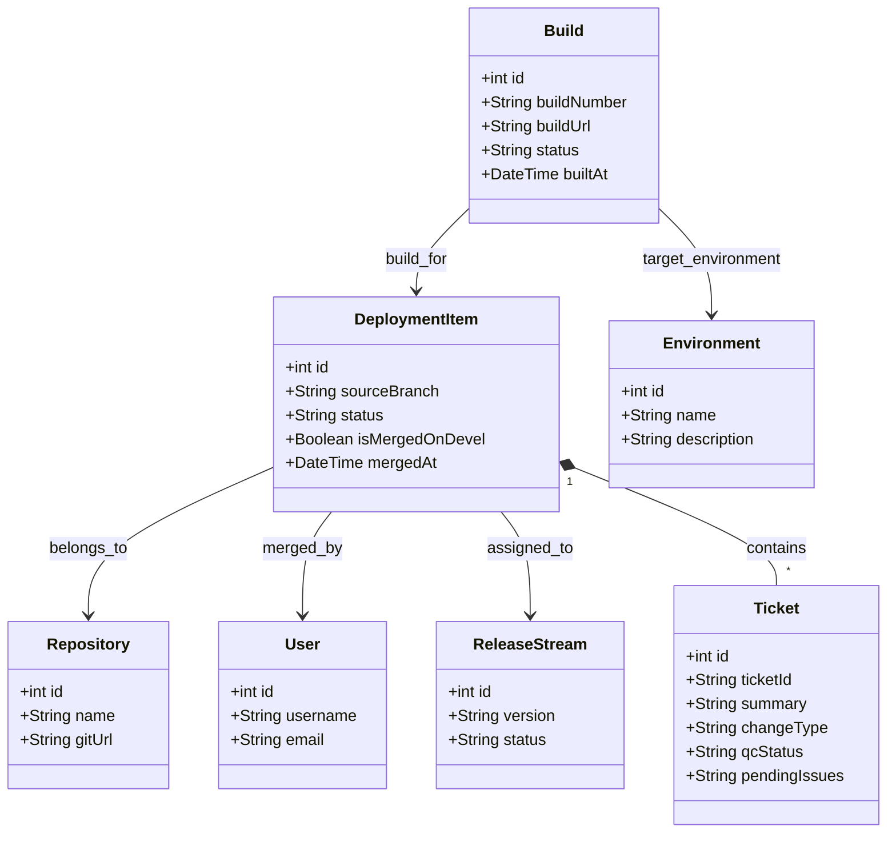

# Thiết kế Domain (Domain Model - MVP V1 & Khả năng Mở rộng Lâu dài)

Để đảm bảo hệ thống có khả năng mở rộng lâu dài từ MVP V1 lên các phiên bản tự động hóa tiếp theo mà không cần phải tái cấu trúc cơ sở dữ liệu (database refactoring), mô hình Domain được thiết kế theo hướng **chuẩn hóa (normalization)** dưới đây. Giao diện người dùng vẫn sẽ hiển thị bảng phẳng tương tự Excel bằng cách tổng hợp (aggregate) dữ liệu từ các thực thể này.



---

## Chi tiết các thực thể và Khả năng Mở rộng (Extensibility Strategy)

### 1. Repository (Kho lưu trữ mã nguồn)
* **Ý nghĩa**: Đại diện cho các dự án (`Core`, `E-com`).
* **Khả năng mở rộng (V2+)**: Có thể thêm các cấu hình Webhook secret, Access Token, Git Provider (GitHub/GitLab) hay cấu hình nhánh mặc định cho riêng từng Repo.

### 2. Ticket (Thẻ công việc)
* **Ý nghĩa**: Lưu thông tin thẻ công việc (ví dụ: `MAG-20479`, `MAG-20550`).
* **Tại sao tách biệt với Deployment Item?** 
  * Thực tế một sự kiện merge có thể chứa nhiều ticket gộp (như dòng 17 trong file Excel: `MAG-20550, MAG-20538...`). Thiết kế quan hệ 1-nhiều hoặc nhiều-nhiều giúp hệ thống giải quyết triệt để trường hợp này.
  * **Mở rộng (V3+)**: Dễ dàng tích hợp đồng bộ tự động với Jira/Trello thông qua API của Ticket mà không ảnh hưởng tới luồng Git merge.

### 3. Build & Environment (Bản build & Môi trường)
* **Ý nghĩa**: 
  * `Environment` định nghĩa các môi trường build (`dev`, `devel`, và sau này là `STG`, `UAT`, `PROD`).
  * `Build` ghi nhận lịch sử build thực tế của từng bản build cụ thể cho từng Ticket.
* **Tại sao không dùng chuỗi text phẳng (Flat String)?**
  * Lưu trữ dạng chuỗi phẳng (ví dụ: `"cxpro-dev2-build, devel"`) sẽ chặn đứng khả năng tự động hóa ở V2.
  * Việc tách ra thực thể giúp ta lưu được các siêu dữ liệu như: Link dẫn đến Jenkins/GitHub Actions build, Trạng thái build (`SUCCESS`/`FAILED`), thời gian chạy build, v.v. Trên UI, ta chỉ cần viết hàm gộp chuỗi để hiển thị đẹp mắt như Excel.

### 4. Deployment Item (Hạng mục Triển khai - Dòng dữ liệu chính)
* **Ý nghĩa**: Lưu thông tin sự kiện merge từ nhánh tính năng (`sourceBranch`) vào nhánh đích, liên kết User thực hiện và phiên bản phát hành (`ReleaseStream`).

### 5. Release Stream (Luồng Phát hành / Fix version)
* **Ý nghĩa**: Định nghĩa phiên bản release (ví dụ: `som/1.12.x`). 
* **Mở rộng (V2+)**: Thêm cấu hình lịch trình, trạng thái phát hành (Draft, Active, Archived).
```
```