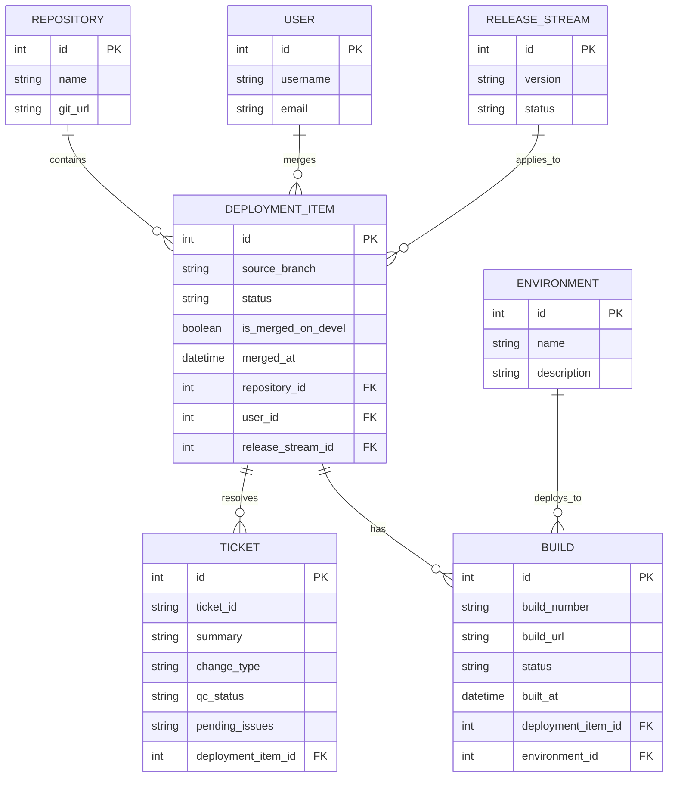

# Database Design (MVP V1 & Khả năng Mở rộng Lâu dài)

Dưới đây là sơ đồ cơ sở dữ liệu quan hệ (ERD) được thiết kế chuẩn hóa để lưu giữ toàn bộ thông tin từ bảng Excel, đồng thời đảm bảo khả năng mở rộng tích hợp CI/CD tự động ở các phiên bản sau:



---

## Chi tiết các bảng dữ liệu (Table Details)

### 1. REPOSITORY
* Quản lý các repository chứa mã nguồn (ví dụ: `Core`, `E-com`).

### 2. USER
* Quản lý thông tin tài khoản người dùng thực hiện merge code.

### 3. RELEASE_STREAM
* Quản lý danh sách các phiên bản phát hành (Fix version - cột C trong Excel).

### 4. DEPLOYMENT_ITEM
* Lưu thông tin một lần merge code từ Git: nhánh nguồn (`source_branch`), liên kết với `REPOSITORY`, `USER`, và được gán cho `RELEASE_STREAM` nào. Chứa trạng thái checkbox `is_merged_on_devel`.

### 5. TICKET
* Lưu trữ thông tin từng mã Ticket (ví dụ: `MAG-20479`, `MAG-20550`). Một `DEPLOYMENT_ITEM` có thể giải quyết nhiều `TICKET` (quan hệ 1-nhiều giúp hiển thị các dòng gộp nhiều ticket trên Excel).
* Chứa trạng thái phân loại (`change_type`), trạng thái kiểm thử (`qc_status`), và ghi chú tồn đọng (`pending_issues`).

### 6. ENVIRONMENT
* Định nghĩa các môi trường hoặc nhánh đích cần build (ví dụ: `dev`, `devel`, `STG`, `UAT`, `Production`).

### 7. BUILD
* Ghi nhận thông tin chi tiết của mỗi bản build: Mã build, liên kết đến Jenkins/GitHub Actions (`build_url`), trạng thái build (`SUCCESS`, `FAILED`), môi trường đích (`environment_id`), và thời gian hoàn thành build.
* Trên giao diện, cột **Branch build** sẽ hiển thị bằng cách gộp tên các môi trường đã build thành công của Ticket đó.
```