# Database Design (MVP V1)

Below is the normalized relational database schema (ERD) designed to store all information from the traditional Excel sheet while ensuring scalability for automated CI/CD integrations in future phases:

```mermaid
erDiagram
    REPOSITORY ||--o{ DEPLOYMENT_ITEM : "contains"
    USER ||--o{ DEPLOYMENT_ITEM : "merges"
    RELEASE_STREAM ||--o{ DEPLOYMENT_ITEM : "applies_to"
    DEPLOYMENT_ITEM ||--o{ TICKET : "resolves"
    DEPLOYMENT_ITEM ||--o{ BUILD : "has"
    ENVIRONMENT ||--o{ BUILD : "deploys_to"

    REPOSITORY {
        int id PK
        string name
        string git_url
    }

    USER {
        int id PK
        string username
        string email
        string password
        string theme
    }

    RELEASE_STREAM {
        int id PK
        string version
        string status
    }

    DEPLOYMENT_ITEM {
        int id PK
        string source_branch
        string status
        boolean is_merged_on_devel
        datetime merged_at
        int repository_id FK
        int user_id FK
        int release_stream_id FK
    }

    TICKET {
        int id PK
        string ticket_id
        string summary
        string change_type
        string qc_status
        string pending_issues
        int deployment_item_id FK
    }

    ENVIRONMENT {
        int id PK
        string name
        string description
    }

    BUILD {
        int id PK
        string build_number
        string build_url
        string status
        datetime built_at
        int deployment_item_id FK
        int environment_id FK
    }
```

---

## Table Details

### 1. REPOSITORY
* Manages source code repositories (e.g., `Core`, `E-com`).

### 2. USER
* Manages user accounts of developers performing code merges. Stores hashed `password` and `theme` preferences.

### 3. RELEASE_STREAM
* Manages the list of release versions (Fix version).

### 4. DEPLOYMENT_ITEM
* Stores a single Git merge event: `source_branch`, linked `REPOSITORY`, executing `USER`, and assigned `RELEASE_STREAM`. Contains the `is_merged_on_devel` checkbox state.

### 5. TICKET
* Stores individual Ticket IDs (e.g., `MAG-20479`). A single `DEPLOYMENT_ITEM` can resolve multiple `TICKET`s (1-to-many relationship).
* Tracks `change_type`, `qc_status`, and `pending_issues`.

### 6. ENVIRONMENT
* Defines target environments or branches (e.g., `dev`, `devel`).

### 7. BUILD
* Records specific build details: Build number, Jenkins/GitHub Actions link (`build_url`), build status (`SUCCESS`, `FAILED`), target `environment_id`, and completion time.
* On the frontend UI, the **Branch build** column is generated by aggregating the names of successfully built environments for a specific ticket.