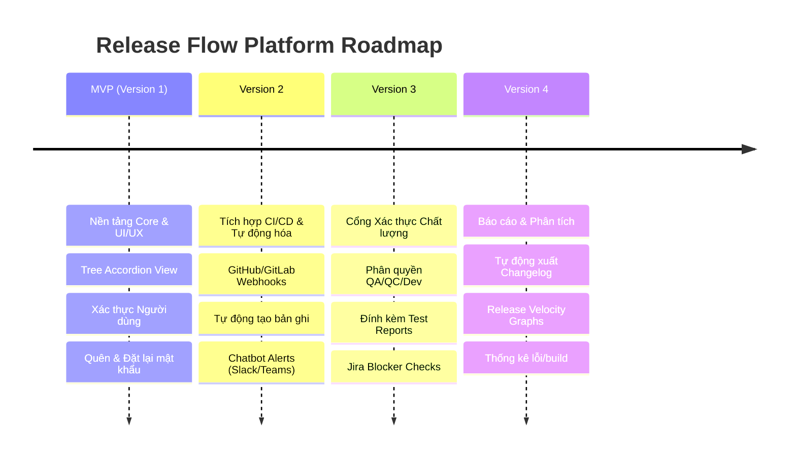

# Lộ trình Phát triển (Product Roadmap)

Tài liệu này mô tả chi tiết lộ trình phát triển của hệ thống **Release Flow Platform** từ phiên bản đầu tiên (**MVP v1**) cho đến các mục tiêu lớn tiếp theo (**V2, V3, V4**).

---

## 🗺️ Tổng quan Lộ trình (Roadmap Overview)

---

## 🔹 MVP v1: Nền tảng Vững chắc & Trải nghiệm Người dùng (Đã Hoàn Thành)
*Trọng tâm: Chuẩn hóa dữ liệu phát hành, nâng cấp UI/UX chuẩn doanh nghiệp và bảo mật hóa tài khoản.*

*   **Hiển thị Phân cấp dạng Cây:** Tổ chức các accordion theo 3 cấp độ (Release Group -> Sub-release -> Deployment Items) kết hợp nét kẻ liên kết trực quan.
*   **Giao diện bảng phẳng Excel-like:** Người dùng nhập liệu nhanh chóng và bộ lọc đa chiều chéo (lọc theo Fix Version dạng cây, Repository, Trạng thái build và Trạng thái QC).
*   **Tương tác thông minh:** Nút `+` quick-create điền sẵn thông tin ngữ cảnh, cascade deletion (xóa liên tầng an toàn) bảo vệ tính toàn vẹn của dữ liệu trong một Transaction duy nhất.
*   **Hệ thống Auth bảo mật:** Hỗ trợ đăng ký, đăng nhập (mật khẩu băm bcrypt), quên mật khẩu và đặt lại mật khẩu an toàn qua email (simulated trong logs ở môi trường local).

---

## 🔹 Version 2: Tích hợp CI/CD & Tự động hóa (Automation Phase)
*Trọng tâm: Loại bỏ hoàn toàn các thao tác nhập liệu thủ công bằng cách kết nối trực tiếp với các nền tảng quản lý mã nguồn.*

### 1. GitHub/GitLab Webhook Integration
*   **Kịch bản:** Khi lập trình viên merge Pull Request (PR) vào các nhánh quan trọng (như `main`, `develop` hoặc `release/*`), GitHub/GitLab sẽ bắn một Webhook event về Backend của Release Flow Platform.
*   **Xử lý ở Backend:**
    *   Tự động trích xuất thông tin PR (Mã Ticket `MAG-xxxxx` từ tên PR, tên nhánh nguồn, tên lập trình viên thực hiện PR).
    *   Tự động phát hiện phiên bản đích (**Fix Version**) dựa trên tên nhánh đích (ví dụ: merge vào `release/1.12` sẽ tự điền Fix Version là `1.12`).
    *   Tự động tạo bản ghi Deployment ở trạng thái `IN PROGRESS`.

### 2. Tự động thông báo qua Chatbot (ChatOps)
*   Tích hợp dịch vụ webhook của **Slack** và **Microsoft Teams**.
*   Ngay khi có bản ghi mới được sinh tự động hoặc thay đổi trạng thái phát hành, chatbot sẽ tự động nhắn thông tin vào kênh phát triển của dự án để đội ngũ lập trình và kiểm thử nắm bắt tức thì.

---

## 🔹 Version 3: Cổng Xác thực Chất lượng (QA/QC Verification Hub)
*Trọng tâm: Cung cấp quy trình kiểm soát chất lượng nghiêm ngặt trước khi đóng gói lên Production.*

### 1. Phân quyền Người dùng (Role-based Access Control - RBAC)
*   **Developer:** Có quyền tạo bản ghi, chỉnh sửa thông tin code branch, build log, đánh dấu `Merge on Devel`.
*   **QA/QC:** Có quyền cập nhật cột `QC Status` (`Testing`, `Passed`, `Failed`), đính kèm link tài liệu kiểm thử hoặc báo cáo tự động (Test Automation Report).
*   **Release Manager (Quản lý phát hành):** Chỉ có vai trò này mới được phép chuyển trạng thái tổng của cả một nhóm phát hành (Release Group) sang `COMPLETED` để kích hoạt Deploy lên Production.

### 2. Tích hợp Jira/GitHub Issues Checkers
*   Hệ thống tự động đồng bộ chéo với **Jira API** hoặc **GitHub API** để kiểm tra trạng thái của các Ticket tương ứng.
*   *Luật phát hành:* Nếu trong danh sách Deployment Items của phiên bản sắp phát hành có chứa bất kỳ Ticket nào đang có trạng thái lỗi nghiêm trọng (Blocker/Critical Bug) đang mở, hệ thống sẽ cảnh báo đỏ và ngăn không cho chuyển trạng thái phát hành Production.

---

## 🔹 Version 4: Báo cáo & Phân tích Thông minh (Analytics Phase)
*Trọng tâm: Đo lường hiệu suất phát hành và tự động hóa khâu làm báo cáo cho đối tác/khách hàng.*

### 1. Tự động tạo Tài liệu Phát hành (Changelog Generator)
*   Cung cấp tính năng xuất tài liệu **Release Notes / Changelog** tự động chỉ với 1 click.
*   Hệ thống tổng hợp tất cả các bản ghi trong phiên bản phát hành, tự động gom nhóm theo loại thay đổi:
    *   🚀 **Tính năng mới (Features)**
    *   🐞 **Sửa lỗi (Bug Fixes)**
    *   ⚡ **Cải tiến hiệu năng (Refactors & Performance)**
*   Hỗ trợ xuất ra định dạng **Markdown** (.md) hoặc **PDF** với header mang logo thương hiệu để gửi trực tiếp cho khách hàng.

### 2. Biểu đồ đo lường Hiệu suất (Executive Dashboard)
*   **Release Velocity:** Biểu đồ đường thể hiện tần suất phát hành theo tuần/tháng.
*   **Build Success Rate:** Biểu đồ tròn hiển thị tỷ lệ build thành công/thất bại trên các môi trường.
*   **Lead Time for Changes:** Thống kê thời gian trung bình từ lúc Developer cập nhật nhánh code cho tới lúc QA nghiệm thu thành công.