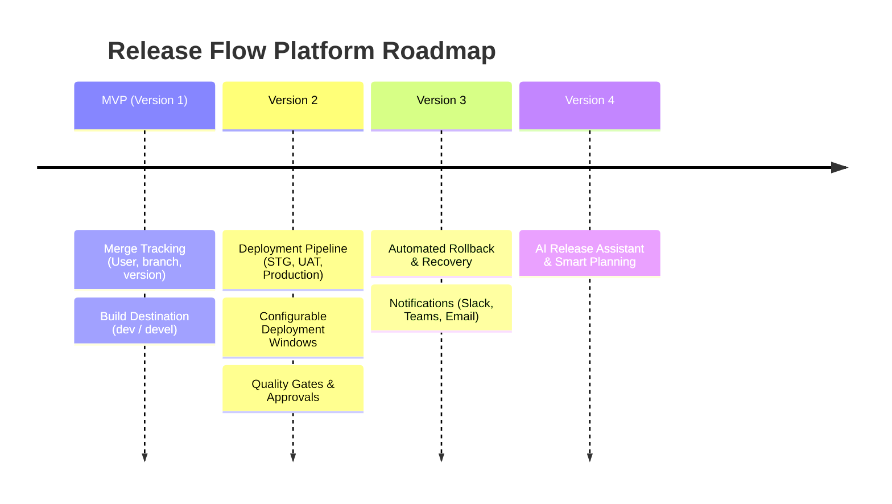

# Roadmap


```mermaid
timeline
    title Release Flow Platform Roadmap
    MVP (Version 1)
        : Merge Tracking (User, branch, version)
        : Build Destination (dev / devel)
    Version 2
        : Deployment Pipeline (STG, UAT, Production)
        : Configurable Deployment Windows
        : Quality Gates & Approvals
    Version 3
        : Automated Rollback & Recovery
        : Notifications (Slack, Teams, Email)
    Version 4
        : AI Release Assistant & Smart Planning
```
```