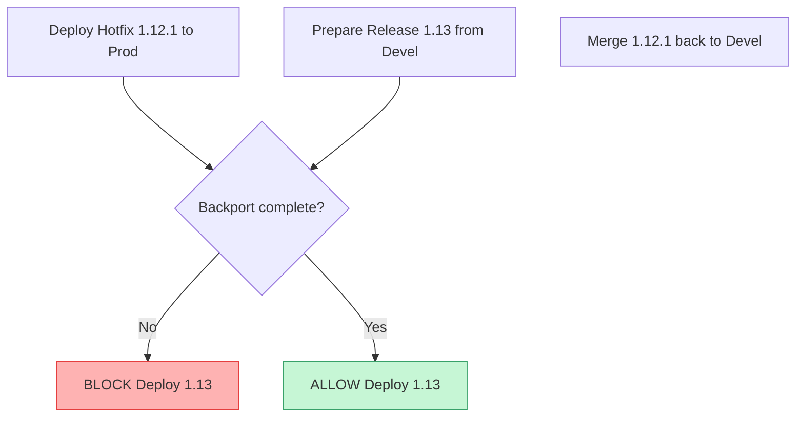
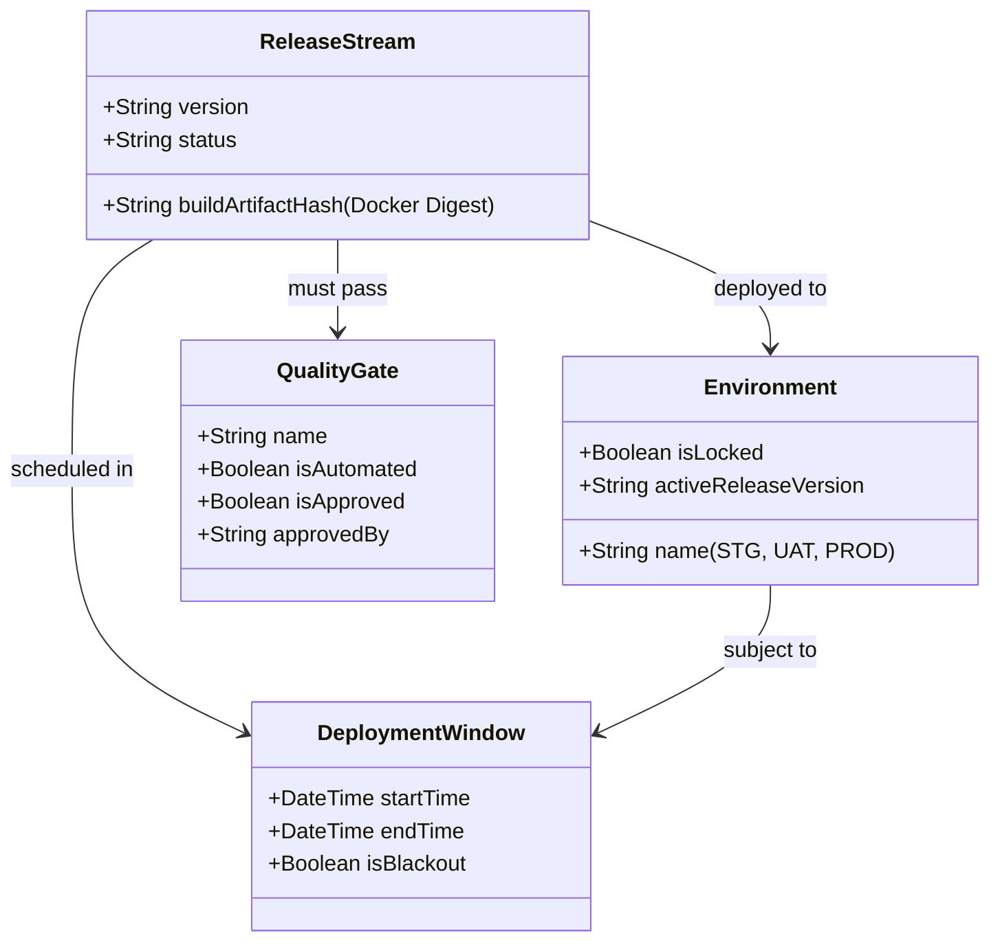

# Đánh giá Kiến trúc & Quy trình Nghiệp vụ: Release Flow Platform

> [!IMPORTANT]
> **Lưu ý về phạm vi MVP V1**: Hiện tại, phiên bản MVP V1 chỉ tập trung vào việc theo dõi thông tin người merge code, nhánh nguồn/đích, phiên bản được gán, và môi trường build mục tiêu (`dev` hoặc `devel`). Các đánh giá chuyên sâu dưới đây về quy trình triển khai phức tạp (STG, UAT, Production), Khung giờ Triển khai (Deployment Windows), Gating, Rollback và các điểm nghẽn liên quan được định hướng phát triển từ **Version 2**.

---

## 1. Tóm tắt Quy trình Hiện tại

Chu kỳ triển khai đề xuất tuân theo một tiến trình tuần tự cho các bản phát hành thông thường (normal release) và một lộ trình trực tiếp đến môi trường Production cho các bản sửa lỗi khẩn cấp (hotfix):

```mermaid
flowchart TD
    %% Quy trình Thông thường
    subgraph Quy trình Phát hành Thông thường
        Dev[Developer] --> FB[Feature Branch]
        FB --> MR[Merge Request]
        MR --> Devel[Merge to Devel]
        Devel --> RV[Assign Release Version]
        RV --> STG[Deploy STG]
        STG --> UAT[Deploy UAT]
        UAT --> Prod[Deploy Production]
    end

    %% Hotfix Flow
    subgraph Hotfix Flow
        ProdSource[Production Codebase] --> HB[Hotfix Branch]
        HB --> RH[Release Hotfix]
        RH --> ProdDeploy[Deploy Production]
    end
    
    style Normal Release Flow fill:#f5f7fa,stroke:#d3d3d3,stroke-width:1px
    style Hotfix Flow fill:#fff5f5,stroke:#feb2b2,stroke-width:1px
```

---

## 2. Kịch bản Nghiệp vụ còn Thiếu

Qua quá trình đánh giá quy trình hiện tại, chúng tôi phát hiện một số kịch bản nghiệp vụ thực tế cực kỳ quan trọng nhưng chưa được đề cập:

### 2.1. Cổng Phê duyệt & Cổng Chất lượng (Release Gating & Quality Gates)
* **Vấn đề**: Quy trình hiện tại chuyển trực tiếp từ `Deploy STG` → `Deploy UAT` → `Deploy Production` mà không có các cơ chế phê duyệt rõ ràng.
* **Kịch bản thiếu**: Ai là người phê duyệt cho việc chuyển môi trường này? Chúng ta cần:
  * **Phê duyệt thủ công**: Trưởng bộ phận QA phê duyệt lên UAT sau khi STG đạt yêu cầu kỹ thuật; Product Owner hoặc khách hàng phê duyệt lên Production sau khi hoàn thành UAT.
  * **Cổng tự động (Automated Gates)**: Tỷ lệ vượt qua kiểm thử tích hợp (ví dụ: >98%), kết quả quét bảo mật (Snyk/SonarQube không có lỗ hổng nghiêm trọng) và kiểm tra hiệu năng (performance budget).

### 2.2. Hotfix Verification & Sandbox Isolation
* **Vấn đề**: Quy trình hotfix đang cho phép triển khai trực tiếp từ `Release Hotfix` lên `Deploy Production`.
* **Kịch bản thiếu**: Đưa code chưa qua kiểm thử trực tiếp lên production tiềm ẩn rủi ro lỗi nghiêm trọng (regression). Cần có một môi trường **Hotfix Sandbox** (hoặc STG-Hotfix) để kiểm tra nhanh (smoke test) trước khi áp dụng lên Production.

### 2.3. Release Bundling vs. Single-Feature Deploys
* **Vấn đề**: Khi nhiều lập trình viên hợp nhất code vào nhánh `devel`, họ được gán chung một phiên bản phát hành (ví dụ: `1.12`).
* **Kịch bản thiếu**: 
  * Làm thế nào để đóng gói nhiều tính năng vào cùng một luồng phát hành?
  * Nếu Tính năng A và Tính năng B đều nằm trong UAT (cùng gói `1.12`), nhưng QA từ chối Tính năng A. Làm sao để **tách** Tính năng A ra khỏi luồng phát hành mà không cần phải viết lại lịch sử Git, hay bắt buộc phải revert code và build lại toàn bộ?

### 2.4. Deployment Freeze / Blackout Calendars
* **Vấn đề**: Khung giờ triển khai có thể cấu hình được, nhưng không có cơ chế áp đặt các hạn chế nghiêm ngặt.
* **Kịch bản thiếu**: Doanh nghiệp thường yêu cầu **đóng băng triển khai** trong các giai đoạn quan trọng (ví dụ: kỳ nghỉ lễ mua sắm lớn, cuối quý tài chính, sự kiện lớn của khách hàng). Hệ thống phải hỗ trợ cấu hình "Blackout Periods" để chặn mọi hoạt động deploy lên Production bất kể cấu hình khung giờ thường nhật thế nào.

### 2.5. Environment Lease & Lease Booking
* **Vấn đề**: Ở hầu hết các công ty, UAT và STG là các môi trường dùng chung và có hạn.
* **Kịch bản thiếu**: Nếu Developer X triển khai bản `1.12` lên UAT, làm thế nào để ngăn Developer Y triển khai bản `1.13` đè lên môi trường kiểm thử của Developer X? Nền tảng cần có khái niệm **Environment Lease** (đăng ký sử dụng môi trường) để khóa môi trường khi đang có người kiểm thử.

### 2.6. Quy trình Rút lui & Khôi phục (Rollback & Recovery Workflow)
* **Vấn đề**: Quy trình hiện tại chưa định nghĩa luồng rút lui khi xảy ra sự cố triển khai hoặc phát hiện lỗi sau khi deploy lên STG/UAT/Production.
* **Kịch bản thiếu**: Cần cung cấp các tuỳ chọn rollback trên nền tảng:
  * **Rollback hạ tầng (Fast Container Rollback)**: Triển khai nhanh Docker Image của phiên bản ổn định trước đó (thời gian chạy < 2 phút).
  * **Rollback Git (GitOps Revert)**: Tự động tạo và thực thi Merge Request revert trên Git để đưa mã nguồn nhánh về trạng thái cũ an toàn và sạch sẽ.

---

## 3. Edge Cases

Đây là các điểm lỗi kỹ thuật và vận hành cần phải được thiết kế giải pháp xử lý trước:

### 3.1. Hotfix Regression Loop / Backporting
* **Tình huống**: Bản hotfix (`1.12.1`) được deploy trực tiếp lên Production.
* **Trường hợp ngoại lệ**: Nếu nhánh hotfix này không được hợp nhất ngược lại (backport) vào nhánh phát triển (`devel`) và các nhánh release tiếp theo (ví dụ: `1.13`), đợt triển khai thông thường kế tiếp sẽ ghi đè và làm mất bản sửa lỗi này, khiến lỗi production xuất hiện trở lại.
* **Yêu cầu kỹ thuật**: Hệ thống phải tự động kiểm tra và chặn đợt deploy tiếp theo nếu chưa hoàn thành việc backport hotfix vào `devel`.

### 3.2. Missed Window Queue Stacking
* **Tình huống**: Một bản phát hành bị lỡ khung giờ triển khai và được chuyển sang "Khung giờ tiếp theo" bởi Decision Engine.
* **Trường hợp ngoại lệ**: Nếu nhiều bản phát hành liên tiếp (ví dụ: `1.12` và `1.13`) đều bị lỡ khung giờ do lỗi hệ thống hoặc chậm trễ kiểm thử, chúng sẽ bị ùn ứ lại.
* **Yêu cầu kỹ thuật**:
  * Chúng ta sẽ deploy tuần tự (tiêu tốn nhiều khung giờ)?
  * Hay gộp chúng thành một bản phát hành lớn duy nhất (làm thay đổi phạm vi kiểm thử)?
  * Decision Engine cần có các chính sách (policy-based rules) để xử lý việc ùn ứ hàng đợi này.

### 3.3. Out-of-Order Version Promotions
* **Tình huống**: Bản `1.12` bị kẹt ở STG do có lỗi. Trong khi đó, bản `1.13` đã hoàn thành kiểm thử và được duyệt ở STG.
* **Trường hợp ngoại lệ**: Bản `1.13` có được phép "vượt mặt" `1.12` để lên Production trước không?
* **Yêu cầu kỹ thuật**: Nếu cho phép vượt mặt, việc di chuyển dữ liệu (database migrations) sẽ được xử lý ra sao? Nếu `1.13` phụ thuộc vào cấu trúc DB mới của `1.12`, việc deploy `1.13` trước sẽ làm sập Production. Hệ thống phải theo dõi được các phụ thuộc của database schema.

### 3.4. Build Artifact Drift
* **Tình huống**: Mã nguồn được biên dịch hoặc đóng gói lại tại mỗi môi trường (STG, UAT, Production).
* **Trường hợp ngoại lệ**: Các thư viện phụ thuộc (dependency) có thể bị phân giải phiên bản khác nhau giữa lúc build STG và lúc build UAT (ví dụ: dùng ký tự đại diện dạng `lodash^4.17.21`), dẫn đến phát sinh lỗi ở UAT mà STG không hề có.
* **Yêu cầu kỹ thuật**: Áp dụng nguyên tắc **Immutable Artifacts (Bản dựng bất biến)**. Build ảnh Docker *duy nhất một lần* (ngay sau khi merge vào `devel`), lấy mã băm định danh (SHA) và dùng chính xác container image đó cho STG, UAT và Production.

---

## 4. Possible Bottlenecks

### 4.1. Tắc nghẽn môi trường dùng chung
* **Mô tả**: STG và UAT đóng vai trò như các nút thắt cổ chai tuần tự. Nếu phát hiện lỗi ở STG, toàn bộ luồng phát hành sẽ bị dừng lại, làm tắc nghẽn các tính năng khác trên `devel` chưa thể đi tiếp.

### 4.2. Webhook Failures & Data Skew
* **Mô tả**: Nền tảng phụ thuộc nhiều vào việc nhận sự kiện Git (Merge Request, Merge). Nếu dịch vụ Git bị gián đoạn hoặc webhook bị thất lạc, trạng thái trên nền tảng sẽ bị sai lệch so với Git thực tế.

### 4.3. Long-Running Database Migrations
* **Mô tả**: Các tác vụ thay đổi cấu trúc cơ sở dữ liệu lớn hoặc gây khóa bảng chạy trong khung giờ triển khai có thể vượt quá giới hạn thời gian cho phép hoặc gây gián đoạn dịch vụ Production.

### 4.4. Microservice Circular Dependencies
* **Mô tả**: Nếu Service A phiên bản `2.0` yêu cầu Service B phiên bản `3.0` phải lên trước, nhưng Service B lại cần Service A mới chạy được. Việc deploy chúng độc lập trong các khung giờ khác nhau sẽ bị thất bại.

---

## 5. Đề xuất Cải tiến Kiến trúc

Để chuyển đổi nền tảng từ một công cụ theo dõi đơn giản thành một **Nền tảng Trí tuệ Phát hành Doanh nghiệp**, chúng tôi đề xuất:

### 5.1. Cập nhật mô hình Domain
Mở rộng mô hình để hỗ trợ quản lý môi trường, cổng chất lượng và các bản dựng bất biến:

### 5.2. Các đề xuất cốt lõi

1. **Build một lần, Promote mọi nơi (Immutable Artifacts)**
   * Lưu mã băm (Docker registry digest/SHA) trong thực thể `ReleaseStream`.
   * Đảm bảo các script triển khai kéo đúng mã băm đã được xác thực ở bước trước, tuyệt đối không build lại code khi chuyển môi trường.

2. **Bắt buộc Backport đối với Hotfix**
   * Thiết lập quy tắc: Khi tạo một bản Hotfix, hệ thống tự động tạo và theo dõi một "Backport Merge Request" từ nhánh hotfix về `devel`.
   * Chặn đợt triển khai production thông thường tiếp theo nếu backport này chưa được hợp nhất (hoặc phải được duyệt bỏ qua bởi cấp quản lý).

3. **Thiết lập Cổng kiểm soát (Gated Progression)**
   * Định nghĩa rõ các **Promotion Gates** trong cấu hình `Pipeline`.
   * Một bản release chỉ được lên môi trường tiếp theo khi tất cả điều kiện của cổng (test pass, manager sign-off) được thỏa mãn.

4. **Hệ thống đặt lịch và Khóa môi trường**
   * Cho phép đặt lịch khóa môi trường STG/UAT (ví dụ: "Nhóm Alpha khóa STG để test bản 1.12 trong 3 tiếng").
   * Từ chối mọi yêu cầu deploy khác lên môi trường này khi đang bị khóa.

5. **Chế độ khẩn cấp bypass (Break-Glass Mode)**
   * Thiết kế một chế độ triển khai khẩn cấp cho Production.
   * Chế độ này bỏ qua các khung giờ triển khai và cổng kiểm duyệt thông thường, nhưng sẽ kích hoạt cảnh báo mức độ cao đến ban giám đốc và tự động mở một tài liệu hậu kiểm sự cố (post-mortem).

6. **Cơ chế tự động đối soát trạng thái (Reconciliation Engine)**
   * Sử dụng một background worker (BullMQ/Redis) để định kỳ (ví dụ 5-10 phút) quét lại Git Repository để tự động cập nhật và sửa các sai lệch dữ liệu nếu có webhook nào bị lỗi.

7. **Chiến lược di chuyển cơ sở dữ liệu (Database Migration - Expand & Contract)**
   * Quy định mọi thay đổi cấu trúc cơ sở dữ liệu (schema migrations) phải tương thích ngược (backward compatible).
   * Áp dụng quy tắc "Expand & Contract": Khi thay đổi cấu trúc, trước tiên mở rộng schema (ví dụ: thêm cột mới và giữ cột cũ song song), chạy ứng dụng tương thích cả hai phiên bản, sau đó chạy job chuyển dữ liệu, và cuối cùng mới xoá cột cũ khi toàn bộ hệ thống đã chạy ổn định.

8. **Tự động hóa đánh số phiên bản (Automated Semantic Versioning)**
   * Tích hợp cơ chế tự động đánh số phiên bản trong CI/CD dựa trên tiêu chuẩn **Conventional Commits** (ví dụ: quét qua tiền tố commit `feat:`, `fix:`, `feat!:`).
   * Khi code được hợp nhất vào `devel` hoặc nhánh release, hệ thống tự động tạo Git Tag tương ứng (SemVer) mà không cần nhập liệu thủ công.

9. **Đặc tả quy tắc cho bộ máy Decision Engine**
   * Thiết lập các chính sách xử lý cụ thể trong Decision Engine khi xảy ra trễ lịch:
     * **Chính sách gộp (Coalescing Policy)**: Nếu bản release trước bị trễ và đè lên khung giờ của bản tiếp theo, Decision Engine sẽ tự động gộp (coalesce) chúng lại và yêu cầu chạy lại kiểm thử tích hợp.
     * **Chính sách hết hạn (Expiration Policy)**: Các bản release nằm chờ trong hàng đợi quá 48 tiếng sẽ tự động bị huỷ (expire) để ngăn việc deploy phiên bản cũ thiếu các cập nhật quan trọng.
